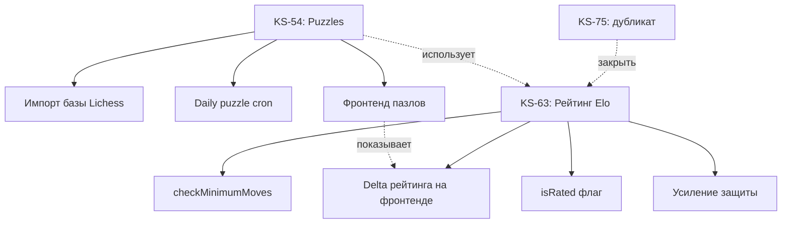

# Архитектурный план: KS-54, KS-63, KS-75

**Задача:** KS-364
**Дата:** 2026-03-10

---

## 1. Анализ дубликатов: KS-63 vs KS-75

### Сравнение scope

| Аспект | KS-63 (Система рейтинга Elo) | KS-75 (Система рейтингов ELO) |
|--------|-------------------------------|-------------------------------|
| Алгоритм расчёта | Elo, K-factor | ELO/Glicko-2 |
| Provisional ratings | Да | Да |
| Обновление после партии | Да | Да |
| Защита от абьюза | Да (min ходов) | Да (манипуляции) |
| Рейтинговые/нерейтинговые | Да | Нет |
| Отображение delta | Да | Да |

### Текущее состояние в коде

**Уже реализовано:**
- `rating.service.ts` — расчёт Elo с K-factor (K=32/40), provisional (порог 20 игр)
- `rating-protection.service.ts` — защита: пара-лимит (3/день), детекция sandbagging и boosting (только логирование)
- Рейтинги по типам контроля: bullet, blitz, rapid, classical
- Сохранение before/after в таблице `games`
- Обновление рейтинга при завершении партии (`game.service.ts → endGame()`)

**Не реализовано / требует доработки:**
- `checkMinimumMoves()` — заглушка, всегда возвращает `allowed: true`
- Sandbagging/boosting — только логируются, не блокируют рейтинг
- Glicko-2 не реализован (только упомянут в KS-75)
- Нет механизма рейтинговых/нерейтинговых партий (флаг `isRated` отсутствует в схеме)
- Нет отображения delta рейтинга на фронтенде после партии

### Рекомендация

**KS-63 и KS-75 — дубликаты.** Объединить в одну задачу KS-63 со следующим scope:

1. Активировать `checkMinimumMoves()` — блокировать рейтинг при < N ходах
2. Решить: блокировать ли рейтинг при sandbagging/boosting (сейчас только логирование)
3. Добавить поле `isRated` в `Game` и логику для нерейтинговых партий
4. Отображение delta рейтинга после партии (фронтенд)
5. Glicko-2 отложить — текущий Elo с provisional достаточен для MVP

**KS-75 — закрыть как дубликат KS-63.**

---

## 2. Анализ: KS-54 — Тактические задачи (Puzzles)

### Текущее состояние в коде

**Уже реализовано:**

Бэкенд:
- `PuzzleModule` — полный CRUD
- Таблица `puzzles` (id, fen, moves, rating, ratingDev, themes, popularity, nbPlays, gameUrl, openingTags)
- Таблица `puzzle_attempts` (userId, puzzleId, solved, timeMs, ratingBefore, ratingAfter)
- Таблица `daily_puzzles` (puzzleId, date)
- `puzzle-rating.service.ts` — Elo для пазлов (K_USER=32, K_PUZZLE=8)
- Подбор по рейтингу: диапазон ±200 от рейтинга пользователя
- Фильтрация по темам (fork, pin, skewer и т.д.)
- Исключение уже решённых пазлов
- API: GET /puzzles/next, POST /puzzles/:id/attempts, GET /puzzles/stats/me

Puzzle Rush:
- `PuzzleRushModule` — полный игровой цикл
- Сессия в Redis (score, lives=3, currentPuzzle, solvedPuzzleIds)
- Режимы: 3 мин и 5 мин
- Лидерборд (таблица `puzzle_rush_scores`)
- API: POST /puzzle-rush/start, POST /puzzle-rush/solve, GET /puzzle-rush/leaderboard

Рейтинг пазлов:
- `ratingPuzzle` в таблице `users` (default 1500)
- Отдельный Elo-пул, не связан с игровым рейтингом

**Не реализовано / требует доработки:**
- Импорт базы Lichess — скрипт импорта отсутствует (таблица есть, данных нет)
- Daily puzzle — таблица `daily_puzzles` есть, но нет cron-задачи для автоматического выбора
- Фронтенд для пазлов — не проверялся в рамках этого анализа

### Что осталось сделать по KS-54

1. **Импорт базы Lichess** — CLI-скрипт для парсинга CSV и bulk insert в `puzzles`
2. **Daily puzzle cron** — задача по расписанию для выбора задачи дня
3. **Фронтенд** — страница пазлов, Puzzle Rush UI, статистика

---

## 3. Зависимости между задачами



**Зависимости:**
- KS-54 (пазлы) зависит от KS-63 (рейтинг) только косвенно — рейтинг пазлов уже реализован отдельно
- KS-63 не зависит от KS-54
- KS-54 и KS-63 можно реализовывать параллельно

---

## 4. Рекомендации по порядку реализации

### Приоритет 1: KS-63 (Рейтинг Elo) — доработка

Минимальный scope, большая часть уже работает. Задачи:

1. Реализовать `checkMinimumMoves()` — например, минимум 5 полуходов для resignation
2. Добавить `isRated: Boolean @default(true)` в модель `Game`
3. Пробросить `isRated` в matchmaking и game creation
4. Пропускать обновление рейтинга для `isRated=false`
5. Передавать delta рейтинга через WebSocket после `endGame()`
6. Отобразить delta на фронтенде в результатах партии

### Приоритет 2: KS-54 (Puzzles) — импорт и cron

1. CLI-скрипт импорта Lichess CSV (https://database.lichess.org/#puzzles)
   - Формат: puzzleId, FEN, Moves, Rating, RatingDeviation, Popularity, NbPlays, Themes, GameUrl, OpeningTags
   - Bulk insert через Prisma `createMany` с batch size ~1000
   - ~4M записей — потребуется streaming parser (csv-parse)
2. Cron для daily puzzle: выбрать пазл с popularity > 90, rating 1200-1800, случайный
3. Фронтенд: страница /puzzles, /puzzle-rush, /puzzle/:id

### Приоритет 3: KS-75 — закрыть как дубликат

Добавить ссылку на KS-63 и закрыть.

---

## 5. Архитектурные заметки

### Импорт Lichess puzzles

Lichess puzzle database — CSV файл ~500MB (4M+ записей). Рекомендации:

- Использовать streaming: `fs.createReadStream` + `csv-parse`
- Batch insert по 1000 записей через `prisma.$executeRawUnsafe` с VALUES
- Добавить индексы: `(rating)`, `(themes)`, `(popularity)` — уже есть в схеме
- Время импорта: ~10-15 минут при batch insert
- Запускать как CLI-команд: `npx ts-node scripts/import-puzzles.ts`

### Glicko-2: почему не сейчас

- Текущий Elo с provisional (K=40 для первых 20 игр) достаточен
- Glicko-2 требует хранения RD (rating deviation) и volatility для каждого игрока
- Нужна миграция схемы: добавить `ratingDevBullet`, `ratingVolatilityBullet` и т.д. (x4 типа)
- Glicko-2 имеет смысл при сотнях активных игроков — преждевременная оптимизация
- Если потребуется — реализовать как отдельную задачу

### Нерейтинговые партии

Добавить в `Game`:
```prisma
isRated Boolean @default(true)
```

В `rating.service.ts → updateRatingsAfterGame()`:
```typescript
if (!game.isRated) {
  this.logger.log(`Rating update skipped: unrated game`);
  return null;
}
```

В matchmaking: передавать `isRated` из настроек создания партии.
