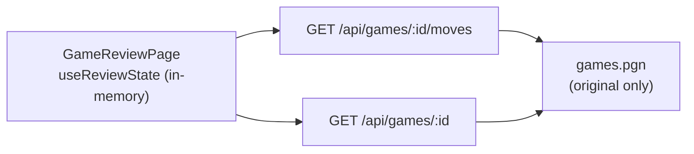
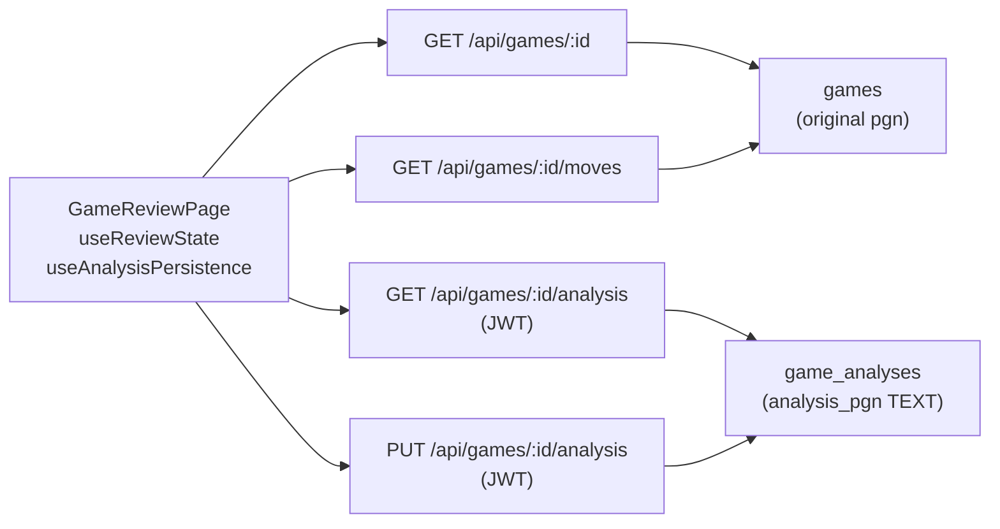
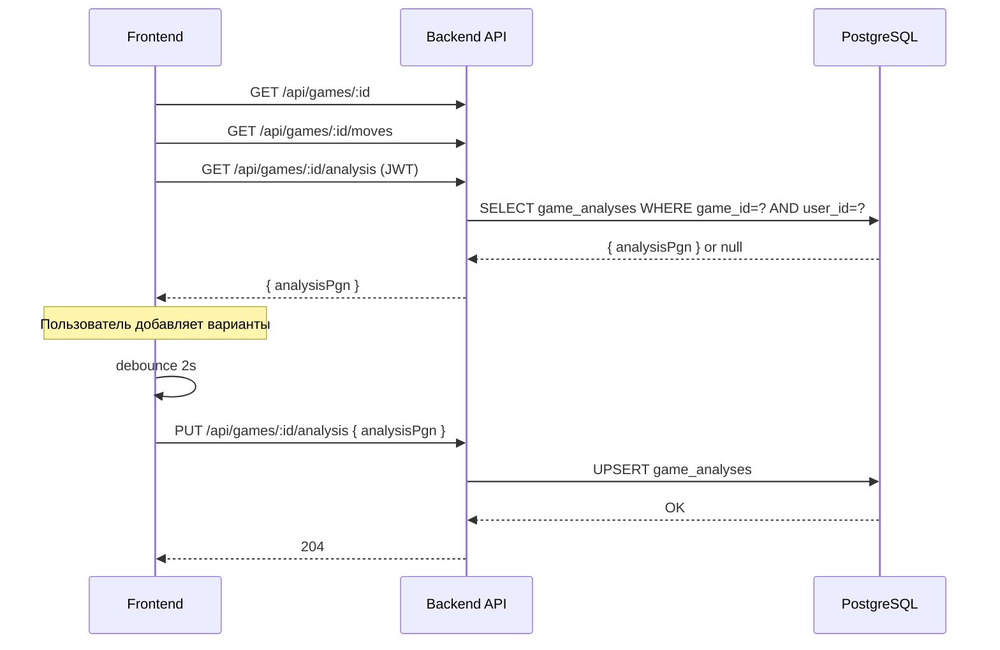

# KS-402: Сохранение вариантов анализа партии

**Дата:** 2026-03-10
**Автор:** architect
**ADR:** [ADR-008](../adr/008-game-analysis-persistence.md)

---

## Текущее состояние



**Проблема:** При закрытии страницы анализа все варианты (`variations: ChessMove[][]`) теряются. Нет механизма сохранения дерева вариантов.

---

## Целевое состояние



---

## Схема БД

### Новая таблица `game_analyses`

```sql
CREATE TABLE game_analyses (
    id          UUID PRIMARY KEY DEFAULT gen_random_uuid(),
    game_id     UUID NOT NULL REFERENCES games(id),
    user_id     UUID NOT NULL REFERENCES users(id),
    analysis_pgn TEXT NOT NULL,
    updated_at  TIMESTAMP NOT NULL DEFAULT NOW(),
    created_at  TIMESTAMP NOT NULL DEFAULT NOW(),
    UNIQUE (game_id, user_id)
);
CREATE INDEX idx_game_analyses_game_id ON game_analyses(game_id);
CREATE INDEX idx_game_analyses_user_id ON game_analyses(user_id);
```

Prisma-модель:

```prisma
model GameAnalysis {
  id          String   @id @default(uuid()) @db.Uuid
  gameId      String   @map("game_id") @db.Uuid
  userId      String   @map("user_id") @db.Uuid
  analysisPgn String   @map("analysis_pgn") @db.Text
  updatedAt   DateTime @updatedAt @map("updated_at")
  createdAt   DateTime @default(now()) @map("created_at")

  game Game @relation(fields: [gameId], references: [id])
  user User @relation(fields: [userId], references: [id])

  @@unique([gameId, userId])
  @@index([gameId])
  @@index([userId])
  @@map("game_analyses")
}
```

Также добавить в модели `Game` и `User`:
```prisma
// Game:
analyses GameAnalysis[]

// User:
gameAnalyses GameAnalysis[]
```

---

## API

### GET /api/games/:id/analysis

**Авторизация:** JWT (обязательно)
**Ответ:**
```json
{ "analysisPgn": "1. e4 e5 2. Nf3 (2. d4 d5) 2... Nc6 *" }
```
или
```json
{ "analysisPgn": null }
```

Возвращает анализ текущего пользователя по данной партии. Если анализа нет — `null`.

### PUT /api/games/:id/analysis

**Авторизация:** JWT (обязательно)
**Тело запроса:**
```json
{ "analysisPgn": "1. e4 e5 2. Nf3 (2. d4 d5) 2... Nc6 *" }
```
**Ответ:** `204 No Content`

Выполняет upsert: если запись `(gameId, userId)` существует — обновляет `analysis_pgn`. Иначе создаёт.

**Ограничения:** максимальный размер `analysisPgn` — 512KB (проверка на уровне DTO).

---

## Изменения Backend

### Файлы для создания/изменения:

```
apps/api/prisma/schema.prisma                 — добавить model GameAnalysis
apps/api/prisma/migrations/...                — миграция Prisma
apps/api/src/game/game.controller.ts          — добавить 2 endpoint
apps/api/src/game/game.service.ts             — добавить методы
apps/api/src/game/dto/game.dto.ts             — добавить SaveAnalysisDto
```

### Новые методы `GameService`:

```typescript
async getAnalysis(gameId: string, userId: string): Promise<{ analysisPgn: string | null }>

async saveAnalysis(gameId: string, userId: string, analysisPgn: string): Promise<void>
```

Реализация `saveAnalysis` — через `prisma.gameAnalysis.upsert`:
```typescript
await this.prisma.gameAnalysis.upsert({
  where: { gameId_userId: { gameId, userId } },
  update: { analysisPgn },
  create: { gameId, userId, analysisPgn },
});
```

---

## Изменения Frontend

### Новые файлы:

```
apps/web/src/review/utils/PgnSerializer.ts      — сериализация дерева в PGN
apps/web/src/review/utils/PgnDeserializer.ts    — десериализация PGN в ChessMove[]
apps/web/src/review/useAnalysisPersistence.ts   — хук автосохранения
```

### Изменить:

```
apps/web/src/pages/GameReviewPage.tsx           — подключить useAnalysisPersistence
                                                  — загружать analysisPgn при открытии
apps/web/src/review/useReviewState.ts           — добавить action LOAD_FROM_PGN
apps/web/src/api.ts                             — добавить методы getAnalysis/saveAnalysis
```

### Хук `useAnalysisPersistence`:

```typescript
function useAnalysisPersistence(gameId: string, history: ChessMove[]) {
  const debouncedSave = useDebouncedCallback(
    (h: ChessMove[]) => {
      const pgn = serializeToAnnotatedPgn(h);
      api.put(`/api/games/${gameId}/analysis`, { analysisPgn: pgn })
         .catch(() => {}); // тихая ошибка
    },
    2000
  );

  useEffect(() => {
    if (history.length > 0) {
      debouncedSave(history);
    }
  }, [history, debouncedSave]);
}
```

### Логика загрузки в `GameReviewPage`:

```
1. Загрузить gameData + moves (как сейчас)
2. Если пользователь авторизован → загрузить GET /api/games/:id/analysis
3. Если analysisPgn !== null → loadFromPgn(analysisPgn)
4. Иначе → loadMoves(apiMoves) (поведение как сейчас)
```

### PGN-сериализация

**`serializeToAnnotatedPgn(history: ChessMove[]): string`**

Обход дерева глубину:
```
function serializeMoves(moves: ChessMove[], startPly: number): string
  для каждого хода:
    - если ply нечётный: добавить номер хода "N."
    - добавить SAN
    - для каждой вариации в move.variations:
        добавить "(" + serializeMoves(variation, variation[0].ply) + ")"
  вернуть строку
```

Результат: `"1. e4 e5 2. Nf3 (2. d4 d5 3. exd5) 2... Nc6 *"`

**`parseAnnotatedPgn(pgn: string, originalMoves: ApiMove[]): ChessMove[]`**

> ⚠️ **Риск.** chess.js `history()` не возвращает дерево вариантов. Варианты:
> 1. Использовать библиотеку `pgn-parser` (npm) — возвращает AST с вариантами
> 2. Написать рекурсивный парсер скобок вручную
>
> Рекомендую вариант 1 (`pgn-parser`). Фронтенд-разработчик должен подтвердить выбор.

Алгоритм: разобрать PGN → AST → восстановить `ChessMove[]` с `variations`, используя `originalMoves` для получения `fen`/`uci` (или проигрывая ходы через `chess.js`).

---

## Последовательность действий



---

## Ограничения и риски

| Риск | Вероятность | Влияние | Митигация |
|---|---|---|---|
| PGN-парсер не поддерживает вложенные вариации | Средняя | Высокое | Оценить `pgn-parser` до начала реализации |
| Большой PGN (>500KB) нагружает БД | Низкая | Среднее | Ограничение размера в DTO (512KB) |
| Гонка запросов при быстрых мутациях | Средняя | Низкое | Debounce 2s + отмена предыдущего запроса |
| Автосохранение для неавторизованных | — | — | Не сохранять если нет JWT |

---

## Порядок реализации

1. **@backend**: Prisma migration, `GameAnalysis` model, `GET/PUT /api/games/:id/analysis`
2. **@frontend**: `PgnSerializer.ts`, `PgnDeserializer.ts`, `useAnalysisPersistence`, интеграция в `GameReviewPage`
