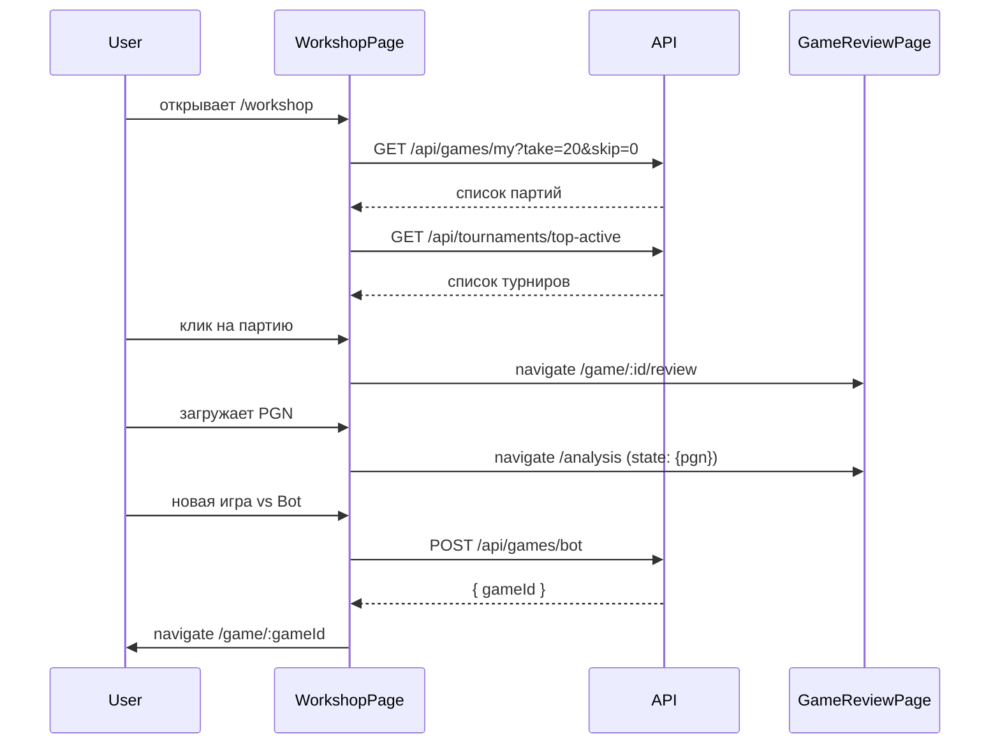

# KS-467: Архитектура раздела «Мастерская»

## Контекст

Задачи KS-464, KS-465, KS-466 реализовали заготовку «Мастерской» в виде тизера на лобби-странице и страницы-заглушки `/workshop`. Теперь требуется полноценная страница с четырьмя функциональными секциями.

Страница анализа (`GameReviewPage`) уже реализована и доступна по маршрутам:
- `/analysis` — новый анализ / загрузка PGN
- `/analysis/:id` — ранее сохранённый анализ
- `/game/:id/review` — анализ завершённой партии

## Маршруты

```
/workshop      — полноценная страница «Мастерская» (protected)
/analysis      — страница анализа (protected)
/analysis/:id  — сохранённый анализ (protected)
/game/:id/review — анализ завершённой партии (protected)
```

## Структура страницы WorkshopPage

```
WorkshopPage
├── WorkshopNewGame        — секция «Новая партия»
├── WorkshopMyGames        — секция «Мои партии»
├── WorkshopTournaments    — секция «Топ активных турниров»
└── WorkshopPgnUpload      — секция «Загрузка PGN»
```

### Секция 1: Новая партия

Быстрый старт без перехода в лобби. Два варианта:
- **vs Human** — запускает матчмейкинг через существующий WebSocket (`/matchmaking`)
- **vs Bot** — открывает выбор уровня бота, затем `POST /api/games/bot`

Выбор контроля времени — набор пресетов (те же, что в LobbyPage). После создания игры — редирект на `/game/:id`.

**Решение:** переиспользовать существующую логику из LobbyPage (компоненты, хуки, socket), не дублировать код.

### Секция 2: Мои партии

Список завершённых партий пользователя с пагинацией.

**API:** `GET /api/games/my?take=20&skip=0`

Данные, возвращаемые эндпоинтом (все поля уже есть):
```typescript
{
  id: string
  playerColor: 'white' | 'black'
  playerResult: 'win' | 'loss' | 'draw' | null
  opponent: { id: string; username: string; ratingBefore: number | null }
  ecoCode: string | null
  openingName: string | null
  result: string        // форматированная строка
  termination: string | null
  timeControlType: string | null
  timeControl: string   // форматированная строка, напр. "5+3"
  totalMoves: number
  createdAt: string
  finishedAt: string | null
  whiteRatingBefore/After, blackRatingBefore/After: number | null
}
```

По клику на партию → переход на `/game/:id/review`.

Пагинация: кнопки «Предыдущие» / «Следующие», параметры `take=20&skip`.

**Новый backend не нужен** — эндпоинт уже реализован.

### Секция 3: Топ активных турниров

Список активных турниров с топ-партиями внутри каждого.

**API:** `GET /api/tournaments/top-active`

Возвращает:
```typescript
{
  id: string
  name: string
  timeControl: string
  activePlayers: number
  topGames: Array<{
    id: string
    whitePlayer: { id: string; username: string; rating: number }
    blackPlayer: { id: string; username: string; rating: number }
    currentFen: string
    pgn: string | null
  }>
}[]
```

По клику на партию → переход на `/game/:id/review`.

**Примечание:** эндпоинт работает на mock-данных (статические названия турниров). Реальные турниры — отдельная задача будущего.

### Секция 4: Загрузка PGN

Файловый инпут (`.pgn`), чтение через FileReader, навигация на `/analysis` с передачей PGN через `useNavigate` state (`{ state: { pgn } }`).

Логика загрузки PGN уже реализована в LobbyPage — перенести/переиспользовать.

## Схема взаимодействия



## Компонентная структура (frontend)

```
apps/web/src/pages/
  WorkshopPage.tsx               — контейнер страницы

apps/web/src/components/workshop/
  WorkshopNewGame.tsx            — секция быстрого старта
  WorkshopMyGames.tsx            — список партий с пагинацией
  WorkshopGameListItem.tsx       — карточка одной партии
  WorkshopTournaments.tsx        — список турниров
  WorkshopTournamentCard.tsx     — карточка турнира с партиями
  WorkshopPgnUpload.tsx          — загрузка PGN файла
```

## API: что уже есть, что нужно

| Эндпоинт | Статус | Назначение |
|----------|--------|-----------|
| `GET /api/games/my` | ✅ готов | Список партий пользователя |
| `GET /api/tournaments/top-active` | ✅ готов (mock) | Топ активных турниров |
| `POST /api/games/bot` | ✅ готов | Создание партии с ботом |
| WebSocket matchmaking | ✅ готов | Матчмейкинг vs Human |

**Новых backend эндпоинтов не требуется.**

## Локализация

Существующие ключи в `translation.json` (секция `workshop`) достаточны. Могут потребоваться дополнения для новых UI элементов.

## Риски

1. **Дублирование кода** — логика выбора контроля времени и матчмейкинга из LobbyPage. Нужно вынести в переиспользуемые компоненты/хуки, а не копировать.
2. **Mock-турниры** — при отсутствии активных игр секция будет пустой. UI должен обрабатывать пустое состояние.
3. **UX перегруженности** — четыре секции на одной странице. Рассмотреть вертикальный скролл или вкладки.
