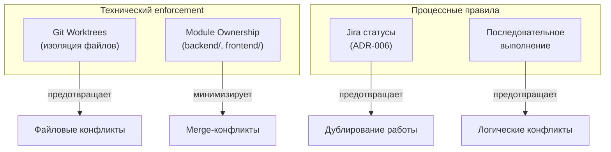

# Анализ проблемы несогласованной работы агентов

## Контекст задачи: KS-199

Агенты (backend, frontend, QA, architect, devops) работают параллельно над общей кодовой базой. Текущие проблемы:

- Конфликтующие изменения в одних файлах
- Агенты не знают о действиях друг друга
- Дублирование и перезапись работы
- Prompt-level инструкции (ADR-006) — необходимы, но недостаточны

## Анализ подходов

### 1. Git worktree — изоляция на уровне файловой системы

**Суть:** Каждый агент работает в отдельном git worktree (отдельная рабочая директория, привязанная к своей ветке). Изменения объединяются через merge в main.

**Плюсы:**
- Полная изоляция — агенты физически не могут перезаписать файлы друг друга
- Нативная поддержка в git, не требует доп. инфраструктуры
- Конфликты обнаруживаются при merge, а не в runtime
- Уже частично используется в проекте (Claude Code worktrees)

**Минусы:**
- Конфликты при merge всё равно возможны — их нужно резолвить
- Агенты работают с потенциально устаревшей веткой, если main ушёл вперёд
- Не решает проблему логических конфликтов (оба агента меняют API-контракт по-разному)

**Оценка:** Высокая эффективность. Уже работает в текущей инфраструктуре.

---

### 2. Jira как единый источник состояния (текущий подход, ADR-006)

**Суть:** Статус задачи в Jira определяет, какой агент может работать. Координатор проверяет статус перед назначением. Последовательное выполнение связанных задач.

**Плюсы:**
- Простая реализация — только правила в промптах
- Аудит через комментарии в Jira
- Не требует технической инфраструктуры

**Минусы:**
- Зависит от дисциплины (промпт-инструкции могут игнорироваться)
- Нет технического enforcement — ничто не мешает запустить двух агентов на одну задачу
- Масштабируется плохо при росте числа задач

**Оценка:** Необходимый минимум, но без технического подкрепления — ненадёжен.

---

### 3. File-level блокировки (lock-файлы)

**Суть:** Агент перед началом работы создаёт lock-файл (`.locks/backend.lock`), другие агенты проверяют наличие блокировки перед модификацией тех же файлов.

**Плюсы:**
- Простая реализация
- Явное обозначение "кто над чем работает"

**Минусы:**
- Granularity проблема: блокировать на уровне файлов — слишком мелко (сотни файлов), на уровне модулей — слишком крупно
- Deadlock при сбое агента (lock не снят)
- Требует cleanup-механизма (TTL для lock-файлов)
- При использовании worktrees — бессмысленно (каждый и так в своей директории)

**Оценка:** Избыточно при наличии worktrees. Актуально только если агенты работают в одной директории.

---

### 4. Очередь задач (task queue)

**Суть:** Все задачи для агентов помещаются в очередь (файловую или через сервис). Агенты берут задачи последовательно, исключая параллельное выполнение конфликтующих задач.

**Плюсы:**
- Гарантия последовательного выполнения
- Приоритизация задач
- Отслеживание статуса

**Минусы:**
- Требует реализации инфраструктуры (очередь, воркер, persistence)
- Полная последовательность — медленно; нужна логика определения "конфликтующих" задач
- Overengineering для текущего масштаба проекта

**Оценка:** Оправдано при 5+ параллельных агентах. Для текущего масштаба — избыточно.

---

### 5. Shared state через файл (agent-state.json)

**Суть:** Общий файл состояния, в котором каждый агент регистрирует: какие файлы/модули он модифицирует, какую задачу выполняет, текущий статус.

**Плюсы:**
- Прозрачность — любой агент видит, кто над чем работает
- Простая реализация

**Минусы:**
- Race condition при одновременной записи в файл
- При использовании worktrees файл не разделяется между директориями (каждый worktree имеет свою копию)
- Требует синхронизации через main или отдельный механизм

**Оценка:** Не совместим с worktree-архитектурой без дополнительных усилий.

---

### 6. Разделение ответственности по модулям (ownership)

**Суть:** Каждый агент "владеет" определёнными директориями. Backend не трогает `frontend/`, frontend не трогает `backend/`. Shared-код (контракты, типы) модифицируется через выделенную процедуру.

**Плюсы:**
- Минимизирует конфликты на архитектурном уровне
- Не требует технической инфраструктуры
- Естественно ложится на структуру монорепо

**Минусы:**
- Shared-зоны (контракты, типы, конфиги) всё равно конфликтогенны
- Не все задачи укладываются в чёткое разделение
- Требует дисциплины (как и Jira-подход)

**Оценка:** Высокая эффективность в комбинации с worktrees.

---

## Текущая архитектура координации

## Рекомендация

Для текущего масштаба проекта (один разработчик, 5 агентов) оптимальна комбинация:

| Уровень | Механизм | Статус |
|---------|----------|--------|
| Файловая изоляция | Git worktrees | ✅ Уже работает |
| Процесс | Jira-статусы, ADR-006 | ✅ Уже работает |
| Архитектура | Module ownership | ⚠️ Частично (монорепо-структура помогает) |
| Shared-зоны | Процедура изменения контрактов | ⚠️ Нужно формализовать |

### Что не нужно реализовывать

- **Микросервисная координация** — overengineering для одного сервера
- **Task queue** — Jira уже выполняет эту роль
- **File locks** — worktrees делают их бессмысленными
- **Shared state файл** — не совместим с worktrees

### Что нужно формализовать

1. **Процедура изменения shared-кода** (пакет `shared/`, контракты API): один агент вносит изменения, остальные подтягивают через rebase/merge из main
2. **Правило rebase перед merge**: агент обязан сделать rebase на актуальный main перед merge своей ветки, чтобы обнаружить конфликты раньше

## Скрипты enforcement (ADR-007)

Технический enforcement правил координации реализован через скрипты в `scripts/`:

| Скрипт | Назначение | Когда запускать |
|--------|-----------|-----------------|
| `check-agent-conflict.sh KS-XX` | Проверка конфликтов worktree и Jira-статуса | Перед началом работы агента |
| `detect-stuck-tasks.sh [TTL]` | Обнаружение зависших задач по TTL коммитов | Периодически (координатор) |
| `pre-merge-check.sh` | Валидация ветки перед merge в main | Перед merge |

### Обнаружение зависших задач

Проблема: агент упал (crash, timeout), задача осталась "В работе", worktree не удалён.

Решение: `detect-stuck-tasks.sh` проверяет возраст последнего коммита в каждом worktree. Если коммит старше TTL (по умолчанию 2 часа) — задача считается зависшей.

Действия при обнаружении:
1. Проверить Jira-статус
2. Перевести задачу обратно в "К выполнению"
3. Удалить worktree: `git worktree remove <path>`

Подробности: [docs/adr/007-anti-duplication-enforcement.md](../adr/007-anti-duplication-enforcement.md)

## Нерешённые проблемы

- Логические конфликты (два агента меняют API-контракт несовместимо) не предотвращаются ни одним техническим средством — только координатор может это контролировать
