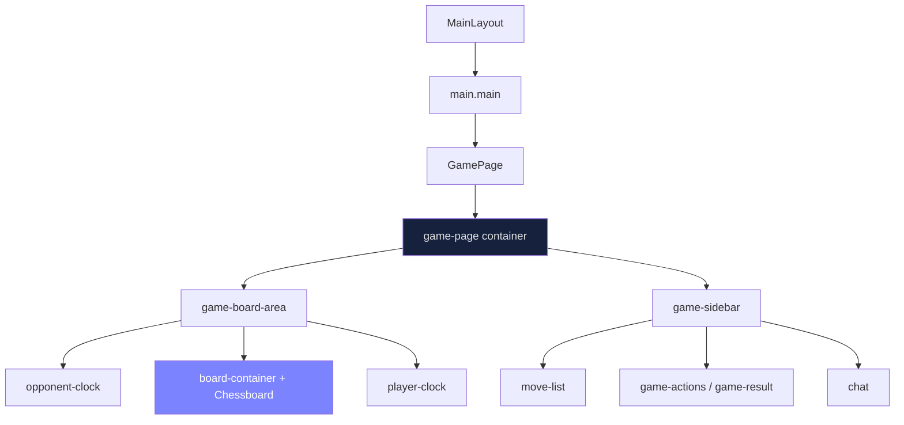

# Редизайн страницы игры (Game Page UX)

## Текущее состояние

Страница игры (`GamePage.tsx`) имеет layout из двух колонок:
- Левая: часы противника + доска (560px фиксированная) + часы игрока
- Правая: sidebar (280px) с ходами, действиями и чатом

Обёртка: `MainLayout` -> `<main className="main">` (max-width: 1200px, padding: 24px)

## Выявленные проблемы

### 1. Доска выходит за пределы viewport по высоте

Фиксированный `boardWidth={560}` + header (~48px) + padding (48px) + часы (2 * ~52px) = ~760px минимум по высоте. На экранах с высотой <=768px (стандартный ноутбук) контент выходит за пределы видимой области.

### 2. Нет адаптивности к размеру экрана

- `boardWidth={560}` — жёстко задано в пропсах `<Chessboard>`
- Sidebar имеет фиксированную `width: 280px`
- Нет media queries и нет использования `vh`/`dvh` единиц
- На экранах < 900px доска + sidebar не помещаются в одну строку

### 3. `.main` ограничивает контент padding'ом

`padding: 24px` на `.main` сужает доступное пространство. Для игровой страницы padding можно минимизировать.

### 4. Sidebar не масштабируется

- `.move-list` с `max-height: 300px` — может занимать слишком много пространства
- `.chat-messages` с `max-height: 200px` — на маленьких экранах суммарная высота sidebar > viewport

## Архитектура решения

### Принцип: board-first layout

Шахматная доска — главный элемент. Размер доски вычисляется от доступного пространства viewport:

```
boardSize = min(
  viewportHeight - headerHeight - clocksHeight - padding,
  viewportWidth - sidebarWidth - gaps - padding
)
```

### Целевая структура (Desktop >= 900px)

```
+--------------------------------------------------+
| Header                                           |
+--------------------------------------------------+
|  [clock]          |  Ходы                        |
|  +----------+     |  1. e4 e5                    |
|  | Шахматная|     |  2. Nf3 Nc6                  |
|  | доска    |     |  ...                         |
|  | (adaptive|     |                              |
|  |  size)   |     |  [Ничья] [Сдаться]           |
|  +----------+     |                              |
|  [clock]          |  Чат                         |
|                   |  ...                         |
+--------------------------------------------------+
```

### Целевая структура (Mobile < 900px)

```
+-------------------------+
| Header                  |
+-------------------------+
| [clock opponent]        |
| +-----------+           |
| | Шахматная |           |
| | доска     |           |
| +-----------+           |
| [clock player]          |
| [Ничья] [Сдаться]       |
| Ходы: 1.e4 e5 2.Nf3... |
| Чат                     |
+-------------------------+
```

## Задачи на фронтенд-разработку

### Задача 1: Адаптивный размер доски

**Файлы:** `GamePage.tsx`, `styles.css`

Изменения:
- Убрать фиксированный `boardWidth={560}`
- Вычислять размер доски через `ResizeObserver` или CSS `container queries`
- Использовать `calc(100vh - headerHeight - clocksHeight - padding)` для ограничения по высоте
- Использовать `calc(100vw - sidebarWidth - gaps)` для ограничения по ширине
- Выбирать `min()` из двух значений

Реализация:
```tsx
// Хук useResponsiveBoardSize
const [boardSize, setBoardSize] = useState(480);
useEffect(() => {
  const calculate = () => {
    const vh = window.innerHeight;
    const vw = window.innerWidth;
    const headerH = 48;
    const clocksH = 2 * 52;
    const padding = 48;
    const sidebarW = vw >= 900 ? 280 + 24 : 0; // sidebar + gap

    const maxByHeight = vh - headerH - clocksH - padding;
    const maxByWidth = vw - sidebarW - 48;
    const size = Math.min(maxByHeight, maxByWidth, 640);
    setBoardSize(Math.max(size, 280)); // минимум 280
  };
  calculate();
  window.addEventListener('resize', calculate);
  return () => window.removeEventListener('resize', calculate);
}, []);
```

### Задача 2: Responsive layout для game-page

**Файлы:** `styles.css`

Изменения:
```css
.game-page {
  display: flex;
  gap: 24px;
  justify-content: center;
  align-items: flex-start;
  min-height: calc(100vh - 48px); /* header height */
  padding: 12px;
}

@media (max-width: 899px) {
  .game-page {
    flex-direction: column;
    align-items: center;
    gap: 12px;
  }
  .game-sidebar {
    width: 100%;
    max-width: 480px;
  }
}
```

### Задача 3: Уменьшить padding .main для game page

**Файлы:** `styles.css` или `GamePage.tsx`

Варианты:
- a) Добавить класс `.main--game` с уменьшенным padding
- b) Использовать CSS `:has(.game-page)` для автоматического определения

```css
.main:has(.game-page) {
  max-width: none;
  padding: 0;
}
```

### Задача 4: Sidebar — адаптивная высота секций

**Файлы:** `styles.css`

Изменения:
- Sidebar должен растягиваться на высоту доски (align-items: stretch на .game-page или явная высота)
- `.move-list` и `.chat` делят доступную высоту через `flex: 1` и `min-height: 0`

```css
.game-sidebar {
  display: flex;
  flex-direction: column;
  gap: 12px;
  width: 280px;
  max-height: calc(100vh - 48px - 24px); /* viewport - header - padding */
  overflow: hidden;
}

.move-list {
  flex: 1;
  min-height: 0;
  overflow-y: auto;
}

.chat {
  flex: 1;
  min-height: 0;
  display: flex;
  flex-direction: column;
}

.chat-messages {
  flex: 1;
  min-height: 0;
  overflow-y: auto;
}
```

## Диаграмма компонентов



## Приоритет задач

| # | Задача | Приоритет | Сложность |
|---|--------|-----------|-----------|
| 1 | Адаптивный размер доски | High | Medium |
| 2 | Responsive layout | High | Low |
| 3 | Padding .main для game page | Medium | Low |
| 4 | Sidebar — адаптивная высота | Medium | Medium |
