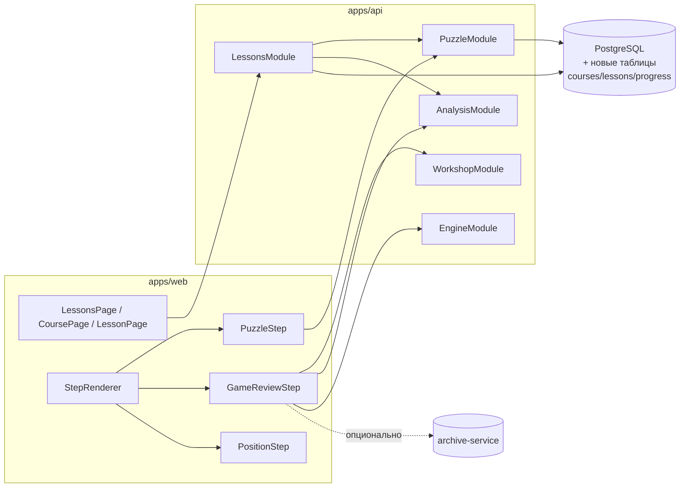

# Раздел «Уроки» (Lessons): архитектурный обзор

Цель документа — дать видение раздела «Уроки» в терминах того, что уже
реализовано в коде и что предстоит доделать. Методическую часть
(чему учить и в каком порядке) отдельно описывает chess-expert.

## 1. Что уже есть и переиспользуется

### 1.1 Backend-модули (apps/api/src)

| Модуль | Что даёт уроку |
|--------|----------------|
| `puzzle` (`puzzle.service.ts`, `puzzle-rating.service.ts`, `glicko-rating.service.ts`) | База задач Lichess + сгенерированных, фильтрация по темам/диапазону рейтинга, отслеживание попыток, Glicko-рейтинг пользователя. Готовый движок тактических шагов урока. |
| `puzzle-rush` | Механика ежедневной тренировки с таймером и лидербордами. Можно привязать как «финальный экзамен» курса. |
| `workshop` + `external-chess.service.ts` | Парсер PGN, импорт игр с chess.com/lichess, `PgnImport`/`PgnImportGame`. Основа для курса «Анализ своих партий». |
| `analysis` (`Analysis` model, `analysis.service.ts`) | Хранение PGN с аннотациями, вариантами, NAG, комментариями. Подходит как формат «разбор-позиция» внутри шага урока. |
| `engine` + `useEngine` + `useStockfish` + `useGameReport` | Локальный Stockfish WASM, отчёт по партии (accuracy, ошибки). Используется в шагах «разбери свою партию». **В уроках используется только Stockfish WASM на клиенте. Серверный движок (`useExternalEngine` / engine-сервис) не используется.** |
| `ai-chat` (`ChatConversation`, `ChatAssistantMessage`) | Может работать как «объясняющий помощник» внутри шага. |
| `user` | Поля `ratingPuzzle`, `ratingBullet/Blitz/Rapid/Classical` — сигнал для рекомендации уровня курса. |
| `archive-service` (отдельный сервис) | Индекс партий пользователя по позициям, `archive-import`. Для продвинутого курса «дебютный репертуар» — готовый источник «все мои партии в этой позиции». |

### 1.2 Frontend-компоненты (apps/web/src)

| Компонент / хук | Применение в уроке |
|-----------------|-------------------|
| `MemoChessboard`, `PuzzleBoard` | Доска для интерактивного шага / задачи. |
| `EvalBar`, `EvalGraph`, `GameReportPanel` | Визуализация анализа в шаге «разбор партии». |
| `ReviewMoveList`, `VariantMoveList`, `VariationChooser` | Навигация по PGN-дереву в обучающих разборах. |
| `hooks/useChessGame`, `useStablePosition`, `useFastDrag`, `useBoardTheme`, `useBoardHighlights`, `useSounds` | Готовая «кухня» доски — не дублировать. |
| `review/` (parseAnnotatedPgn, PgnSerializer, useReviewState) | Аннотированный PGN с NAG и комментариями — формат «учебный разбор». |
| `components/workshop/ImportExternalModal` | Импорт партий с Lichess/chess.com прямо из шага урока. |
| `HelpButton`, i18n (`react-i18next`), `NotificationDropdown` | Общая обвязка страницы. |

### 1.3 Данные

- `Puzzle` содержит `themes` (мат-в-1, вилки, связки, эндшпиль …) и `rating` —
  этого достаточно, чтобы собрать подборку задач под конкретный урок
  курированным списком ID или фильтром `themes+rating`.
- `PuzzleAttempt` уже хранит попытки и `solved` — можно считать прогресс урока,
  не заводя отдельную таблицу попыток.
- `Analysis` умеет хранить PGN с аннотациями и `category`/`tags` — можно
  использовать как «готовый разбор» в шаге урока.
- `GameAnalysis` привязан к сыгранной партии — используется для шагов «разбери
  свою партию».

## 2. Чего не хватает

### 2.1 Новые сущности данных (packages/db/prisma/schema.prisma)

```
Course
  id, slug, level (beginner|intermediate|advanced),
  title_i18n_key, description_i18n_key,
  order, isPublished

Lesson
  id, courseId, order, slug,
  title_i18n_key, summary_i18n_key,
  kind (theory | tactics_set | endgame_set |
        opening_line | game_review | quiz),
  payload (JSONB: параметры урока — подборка puzzleIds,
           список позиций, ссылки на Analysis и т. п.)

LessonStep
  id, lessonId, order,
  type (text | position | puzzle | video | quiz | game_review),
  payload (JSONB)

UserCourseProgress
  userId, courseId, startedAt, completedAt,
  currentLessonId
  @@unique(userId, courseId)

UserLessonProgress
  userId, lessonId, startedAt, completedAt,
  score, stepsState (JSONB: { [stepId]: "done" | "failed" | ... })
  @@unique(userId, lessonId)
```

Заметки по схеме:
- `payload` JSONB — сознательный компромисс против «таблиц под каждый тип шага».
  Один разработчик, много типов шагов → JSONB + валидация zod/class-validator
  на бэке.
- Попытки решения задач внутри урока не дублируются — пишем в существующий
  `PuzzleAttempt`, в `UserLessonProgress.stepsState` храним только агрегат.
- `title_i18n_key` вместо хранения текстов в БД: сами тексты лежат в
  `apps/web/src/i18n/*` / `apps/api/src/i18n/*` — как и остальной контент
  проекта. Админки на первом этапе не делаем.

### 2.2 Рекомендательная логика

Минимум на старте:
- Пользователь явно выбирает уровень (3 кнопки) — главный путь.
- Авто-подсказка по `user.ratingPuzzle` (источник истины — ADR-024 §2.3):
  - `r < 1200` → beginner
  - `1200 ≤ r < 1800` → intermediate
  - `r ≥ 1800` → advanced
  - анонимный / `ratingPuzzle` отсутствует → beginner (`reason: 'default'`)
- Никаких ML — жёсткие пороги, одна функция (`CoursesService.recommendLevel`
  в `apps/api/src/lessons/courses.service.ts`).

### 2.3 Контент

- Нет содержимого уроков. Нужно завести его как seed-фикстуры
  (`apps/api/src/lessons/seed/*.ts` или YAML/JSON), накатываемые скриптом.
- Для курированных наборов задач — списки `puzzleId` в seed-файле, проверка
  целостности при запуске seed.
- Тексты — через i18n, картинки — в `apps/web/public/lessons/`.

### 2.4 Типы шагов, которых сейчас нет

| Тип шага | Что нужно доделать |
|----------|--------------------|
| `text` | Markdown-рендер (уже нужен в проекте, простой компонент). |
| `position` (интерактивная: «сделай ход пешкой e2-e4») | Новый компонент: `MemoChessboard` + валидатор ожидаемого хода/набора ходов через `chess.js`. |
| `puzzle` | Обёртка над уже существующим `PuzzleBoard` + API задачи. |
| `game_review` | Переиспользует `AnalysisPage`-часть + `GameReportPanel` + `ImportExternalModal`. |
| `quiz` (мульти-выбор) | Новый простой компонент. |
| `video` | Простой `<iframe>`-рендер (YouTube/Vimeo), опционально. |

## 3. Предлагаемая структура модулей

### 3.1 Backend (apps/api/src/lessons)

```
lessons/
  lessons.module.ts
  courses.controller.ts        GET /courses, GET /courses/:slug
  lessons.controller.ts        GET /lessons/:id,
                               POST /lessons/:id/progress/start,
                               POST /lessons/:id/progress/step,
                               POST /lessons/:id/progress/complete
  courses.service.ts
  lessons.service.ts
  progress.service.ts
  recommend.service.ts         выбор курса по рейтингу
  dto/
  seed/                        фикстуры курсов (beginner-basics.ts, ...)
```

Интеграция: `LessonsModule` импортирует `PuzzleModule`, `AnalysisModule`,
`WorkshopModule` — чтобы шаги умели дернуть уже существующую логику (получить
задачу по id, создать `GameAnalysis` и т. д.).

### 3.2 Frontend (apps/web/src)

```
pages/
  LessonsPage.tsx           /lessons            каталог по уровням
  CoursePage.tsx            /lessons/:slug      список уроков + прогресс
  LessonPage.tsx            /lessons/:slug/:lessonSlug   проходчик шагов

components/lessons/
  CourseCard.tsx
  LessonList.tsx
  LessonProgressBar.tsx
  StepRenderer.tsx          диспетчер по type
  steps/
    TextStep.tsx
    PositionStep.tsx        интерактивная позиция
    PuzzleStep.tsx          обёртка над PuzzleBoard
    GameReviewStep.tsx      импорт + разбор
    QuizStep.tsx
    VideoStep.tsx

hooks/
  useLessonProgress.ts
  useCourseRecommendation.ts
```

Роутинг — добавляется в `App.tsx` рядом с `/puzzle`, `/workshop`,
`/analysis`. В `Sidebar.tsx` — пункт «Уроки» (i18n ключ).

### 3.3 Shared (packages/shared/src/types/lessons.ts)

Контракты `Course`, `Lesson`, `LessonStep`, типы `payload` для каждого
`type` шага (union), ответы API прогресса. Единый источник истины.

## 4. Как встраивается в текущую архитектуру



Ключевая идея: `LessonsModule` — тонкий слой над уже существующими
движками (puzzle, analysis, workshop, engine). Почти весь «тяжёлый» код
уже есть, дописывается оболочка «курс → урок → шаг» и прогресс.

## 5. Поэтапный план (для координатора)

1. **ADR-024: Lessons module** — зафиксировать решение и схему.
2. **Prisma-миграция**: 5 новых таблиц (см. §2.1). Только backend.
3. **Seed + API**: `LessonsModule`, один демо-курс «Начинающие: как ходят
   фигуры» + «Начинающие: базовая тактика» (курируемый набор `puzzleId`).
4. **Shared types** `packages/shared/src/types/lessons.ts`.
5. **Frontend каркас**: `LessonsPage`, `CoursePage`, `LessonPage`,
   `StepRenderer` + `TextStep` + `PuzzleStep` (переиспользует `PuzzleBoard`).
6. **PositionStep** (интерактивная позиция) — новый компонент.
7. **GameReviewStep** для курса «Опытные: анализ своих партий» —
   переиспользует `WorkshopPage`/`AnalysisPage`-компоненты.
8. **QuizStep** — по остаточному принципу, если понадобится методически.
9. **Рекомендатор уровня** — простая функция в `lessons.service.ts`.
10. Контент наращивается итеративно через seed-фикстуры.

## 6. Риски и ограничения

- Один разработчик → избегаем админки уроков на старте, контент через seed.
- `payload` JSONB даёт гибкость, но требует строгой валидации на входе
  (class-validator DTO + дискриминированный union).
- Нагрузка по БД минимальная — это read-heavy контент + write на прогресс.
  Индексы: `UserLessonProgress(userId, lessonId)`, `Lesson(courseId, order)`.
- Миграция и schema.prisma — только backend (ownership).
