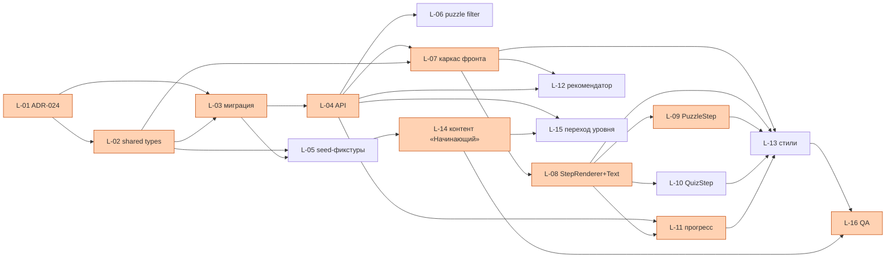

# Раздел «Уроки»: план разработки (roadmap)

Сводный план на основе архитектурного видения
(`docs/architecture/lessons-module.md`, KS-1753) и методического
видения (KS-1754). Источник для декомпозиции карточек в трекере
(создаёт координатор).

Условные обозначения:
- **Исполнитель:** backend / frontend / layout / devops / architect / chess-expert (контент) / qa
- **Оценка:** S (до 1 дня) / M (1–3 дня) / L (3+ дней)
- **ID `L-NN`** — временный идентификатор для этого документа; в трекере
  координатор заводит задачи как KS-XXXX и проставляет соответствие.

## 0. ADR — до или параллельно?

- **ADR-024 «Lessons module»** — пишется **до** `L-03` (миграция Prisma),
  т. е. в самом начале MVP параллельно с `L-02` (shared types). Фиксирует:
  5 сущностей, JSONB `payload` + политика валидации, отказ от админки
  в MVP, прогресс-политика (≥70% «пройден», ≥80% «освоено», повтор 7–14
  дней), границы ответственности LessonsModule vs Puzzle/Analysis/Workshop.
- **ADR-025 «SM-2 для повторения уроков»** — в начале итерации 2, до `L-21`.
- Остальные итерации ADR не требуют — достаточно обновлений
  `lessons-module.md`.

---

## 1. MVP — курс «Начинающий»

Цель: запустить раздел `/lessons` с курсом «Начинающий»
(~30 уроков, 6 блоков). Форматы шагов в MVP: **статья+диаграммы (TextStep)**,
**задача (PuzzleStep)**, **мини-тест (QuizStep)**. Прогресс: не начат /
в процессе / пройден (≥70%). Повторы и «освоено» — итерация 2.

### Задачи MVP

| ID    | Summary                                                          | Исполнитель        | Оценка | Зависит от            |
|-------|------------------------------------------------------------------|--------------------|--------|-----------------------|
| L-01  | ADR-024: Lessons module (схема, payload-политика, прогресс)      | architect          | S      | —                     |
| L-02  | Shared types: Course/Lesson/LessonStep + discriminated StepPayload | backend          | S      | L-01                  |
| L-03  | Prisma-миграция: 5 таблиц + индексы (`packages/db`)              | backend            | M      | L-01, L-02            |
| L-04  | LessonsModule API: courses/lessons/progress controllers + service | backend           | M      | L-03                  |
| L-05  | Формат seed-фикстур + скрипт `seed-lessons` + линтер FEN/PGN     | backend            | M      | L-02, L-03            |
| L-06  | Puzzle API: фильтр по темам+рейтингу для курируемых наборов (ревизия существующего) | backend | S | L-04                  |
| L-07  | Frontend-каркас: роуты `/lessons`, `LessonsPage`, `CoursePage`, `LessonPage` + пункт в `Sidebar` | frontend | M | L-02, L-04 |
| L-08  | StepRenderer + TextStep (markdown + FEN-диаграммы read-only)     | frontend           | M      | L-07                  |
| L-09  | PuzzleStep (обёртка `PuzzleBoard`, запись в `PuzzleAttempt`)     | frontend           | S      | L-08                  |
| L-10  | QuizStep (мульти-выбор, локальная проверка)                      | frontend           | S      | L-08                  |
| L-11  | `useLessonProgress` + отметка шагов + порог ≥70% «пройден»       | frontend           | S      | L-04, L-08            |
| L-12  | Рекомендатор уровня по `ratingPuzzle` (backend-правило + UI)     | backend + frontend | S      | L-04, L-07            |
| L-13  | Стили и адаптив страниц `/lessons/*`                             | layout             | M      | L-07..L-11            |
| L-14  | **Контент «Начинающий»**: 6 блоков / ~30 уроков (фикстуры)       | chess-expert       | L      | L-05                  |
| L-15  | Критерий перехода «Начинающий → Средний» (puzzle≥1200 + ≥20 партий + все уроки) — API + UI-плашка | backend + frontend | S | L-04, L-14 |
| L-16  | QA: прохождение курса «Начинающий» end-to-end                    | qa                 | M      | L-13, L-14            |

### Критический путь MVP

```
L-01 → L-02 → L-03 → L-04 → L-07 → L-08 → L-09 → L-11 → L-14 → L-16
```

Запуск раздела «Уроки» с курсом «Начинающий» блокируют именно эти задачи.
Остальное (L-06, L-10, L-12, L-13, L-15) — полезно, но параллельно и
не блокирует включение.



### Параллелизация

- `L-14` (контент) стартует сразу после `L-05` и идёт **в параллель** с
  фронтом — самая длинная позиция, нельзя ставить в конец.
- `L-06`, `L-10`, `L-12`, `L-15` — не в критическом пути, берутся по
  мере освобождения.
- Один разработчик: реалистично backend-блок (L-01..L-06) → frontend-блок
  (L-07..L-13) → интеграция. Контент стартует параллельно как только
  готов L-05.

### Методические пробелы, закрываемые в MVP

- **Фильтр puzzle по темам** (для курируемых наборов) — `L-06`.
- **Редактор уроков (частично)** — не UI, а формат seed-фикстур + линтер
  FEN/PGN (`L-05`). Полноценный редактор — итерация 2.
- Остальные пробелы (SM-2, тренажёры, дневник, интерактивные позиции
  inline) — **не в MVP**.

---

## 2. Итерация 2 — курс «Средний», интерактив и повторения

Цель: второй курс + три ключевых методических пробела (интерактивные
позиции, SM-2, тренажёр против движка с ограничением силы).

| ID    | Summary                                                             | Исполнитель        | Оценка | Зависит от            |
|-------|---------------------------------------------------------------------|--------------------|--------|-----------------------|
| L-20  | ADR-025: SM-2 для повторения уроков                                 | architect          | S      | MVP готов             |
| L-21  | Prisma: `LessonReview` (easiness, interval, dueAt) + сервис + cron  | backend            | M      | L-20, L-04            |
| L-22  | UI «К повторению сегодня» + прохождение повтора + порог ≥80%        | frontend           | M      | L-21                  |
| L-23  | PositionStep (интерактивная inline-позиция, проверка ожидаемых ходов, подсказки) | frontend | M | L-08                  |
| L-24  | Эндшпильный тренажёр против Stockfish с ограничением силы (UCI Skill Level, запасной план — серверный движок) | frontend (+ backend, если нужен proxy) | L | L-23, существующий `useEngine` |
| L-25  | **Контент «Средний»**: 6 блоков / ~48 уроков (включая позиции для PositionStep и эндшпильного тренажёра) | chess-expert | L | L-05, L-23, L-24 |
| L-26  | Критерий перехода «Средний → Опытный» (puzzle≥1700 + rapid≥1400 + ≥500 задач + все уроки) — API + UI | backend + frontend | S | L-04                  |
| L-27  | Редактор уроков (MVP-редактор): локальный form-based инструмент для chess-expert — markdown + FEN/PGN блоки + предпросмотр + экспорт в формат seed-фикстур | backend + frontend | L | L-05                 |
| L-28  | QA: прохождение курса «Средний», SM-2 повторения, тренажёр          | qa                 | M      | L-22, L-24, L-25      |

### Методические пробелы, закрываемые в итерации 2

- **Интерактивные позиции inline** — `L-23`.
- **SM-2 (освоено ≥80%, повтор 7–14 дней)** — `L-20..L-22`.
- **Тренажёр против движка с ограничением силы** — `L-24`.
- **Редактор уроков (полноценный)** — `L-27`.

---

## 3. Итерация 3 — курс «Опытный», трек D и адаптивность

Цель: третий уровень, ключевой трек D «Анализ своих партий»,
закрытие оставшихся методических пробелов.

| ID    | Summary                                                             | Исполнитель        | Оценка | Зависит от            |
|-------|---------------------------------------------------------------------|--------------------|--------|-----------------------|
| L-30  | GameReviewStep + трек D: импорт партии (ExternalChessService), разбор с GameReport, чек-лист направляющих вопросов | backend + frontend | L | L-08, L-11, существующие workshop/analysis/engine |
| L-31  | Дневник ошибок: таблица `UserMistake` (puzzleId или gameId+ply+themes), агрегаты, рекомендация «повторить темы X,Y» | backend + frontend | M | L-11, L-21            |
| L-32  | Дебютный тренажёр (трек A): хранение PGN-дерева линий, проверка ходов, ответы движка/соперника, обработка отклонений | backend + frontend | L | L-23                  |
| L-33  | Адаптивная сложность: алгоритм подстройки follow-up задач по серии успех/провал | backend | M   | L-06, L-11            |
| L-34  | VideoStep (iframe YouTube) — только если методически появится необходимость | frontend    | S      | L-08                  |
| L-35  | **Контент «Опытный»** треки A/B/C/E, 60–150 уроков (итеративно, релиз блоками) | chess-expert | L+   | L-27, L-30, L-32      |
| L-36  | QA: трек D (анализ своих партий), дневник ошибок, дебютный тренажёр | qa                 | M      | L-30, L-31, L-32      |

### Методические пробелы, закрываемые в итерации 3

- **Дневник ошибок** — `L-31`.
- **Адаптивная сложность** — `L-33`.
- **Дебютный тренажёр** — `L-32`.
- **Трек D (анализ своих партий)** — `L-30`.

---

## 4. Соответствие методических пробелов итерациям (таблица)

| Пробел (из KS-1754)                       | Итерация | Задача       |
|-------------------------------------------|----------|--------------|
| Фильтр puzzle по темам                    | MVP      | L-06         |
| Формат авторинга (seed + линтер)          | MVP      | L-05         |
| Интерактивные позиции inline              | 2        | L-23         |
| SM-2 (повторения, «освоено»)              | 2        | L-20..L-22   |
| Тренажёр против движка (ограничение силы) | 2        | L-24         |
| Редактор уроков (UI)                      | 2        | L-27         |
| Анализ своих партий / трек D              | 3        | L-30         |
| Дневник ошибок                            | 3        | L-31         |
| Дебютный тренажёр                         | 3        | L-32         |
| Адаптивная сложность                      | 3        | L-33         |

---

## 5. Риски

### Технические

- **JSONB `payload` без строгой валидации.** Митигация: class-validator
  DTO на входе API + дискриминированный union в shared + юнит-тесты на
  каждый `type` шага. Прод-валидация seed через `L-05`.
- **Стабильность `puzzleId` в курируемых наборах.** Lichess puzzle id
  стабильны, но сгенерированные задачи могут пересобираться. Митигация:
  линтер seed падает при отсутствии id; в курсах «Начинающий/Средний»
  опираться **только** на Lichess-источник.
- **Stockfish в браузере с `UCI Skill Level`** ведёт себя неустойчиво на
  старых wasm-сборках. Митигация: план Б — серверный движок через
  существующий `useExternalEngine` / engine-сервис.
- **Cron для SM-2.** Нужен планировщик. Митигация: используем существующий
  подход (или BullMQ поверх Redis, или простой cron-контроллер); ADR-025
  фиксирует выбор.
- **Сцепка трека D с workshop/analysis/engine/archive-service.** Много
  зависимостей. Митигация: изолировать в `GameReviewStep`, не втягивать
  эту логику в другие шаги.
- **Нагрузка на БД.** Контент read-heavy, прогресс write-medium. Индексы
  `UserLessonProgress(userId, lessonId)`, `Lesson(courseId, order)`,
  `LessonReview(userId, dueAt)` — обязательны в миграции.

### Контентные

- **Объём контента.** 30 + 48 + 60+ уроков — единственный chess-expert
  не закроет в разумный срок. Митигация: MVP — не больше 30 уроков,
  порезать блоки при переборе; трек E и часть трека A в 3-й итерации
  релизится блоками, а не единовременно.
- **Качество FEN/PGN.** Митигация: линтер в `L-05` прогоняет chess.js
  валидацию и проверяет наличие `puzzleId`.
- **i18n.** ru + en удваивают работу. Митигация: MVP — только `ru` в
  контенте, `en` — после L-16. Ключи i18n заложены с самого начала.
- **Методические критерии «освоено ≥80% через 7–14 дней»** могут
  демотивировать. A/B не делаем, мониторим drop-off руками, при
  необходимости ослабляем пороги через конфиг.

### Организационные

- **Один разработчик, критический путь MVP длинный.** Митигация:
  контент (`L-14`) стартует параллельно фронту, `L-13` (стили) — в
  самом конце, `L-16` (QA) — последним звеном.
- **Риск потери контекста между итерациями.** Митигация: ADR-024 (MVP)
  и ADR-025 (итерация 2) фиксируют решения; roadmap обновляется по мере
  закрытия задач.

---

## 6. Что делаем сразу после приёмки плана

1. Координатор создаёт карточки в трекере по задачам MVP (L-01 … L-16),
   выставляя assignee согласно таблице. Для задач 2-й и 3-й итерации —
   отложенный бэклог.
2. Первой в работу берётся `L-01` (ADR-024) — архитектор.
3. Параллельно стартует `L-02` (shared types) — backend.
4. Как только готов `L-05` — chess-expert начинает `L-14`.
