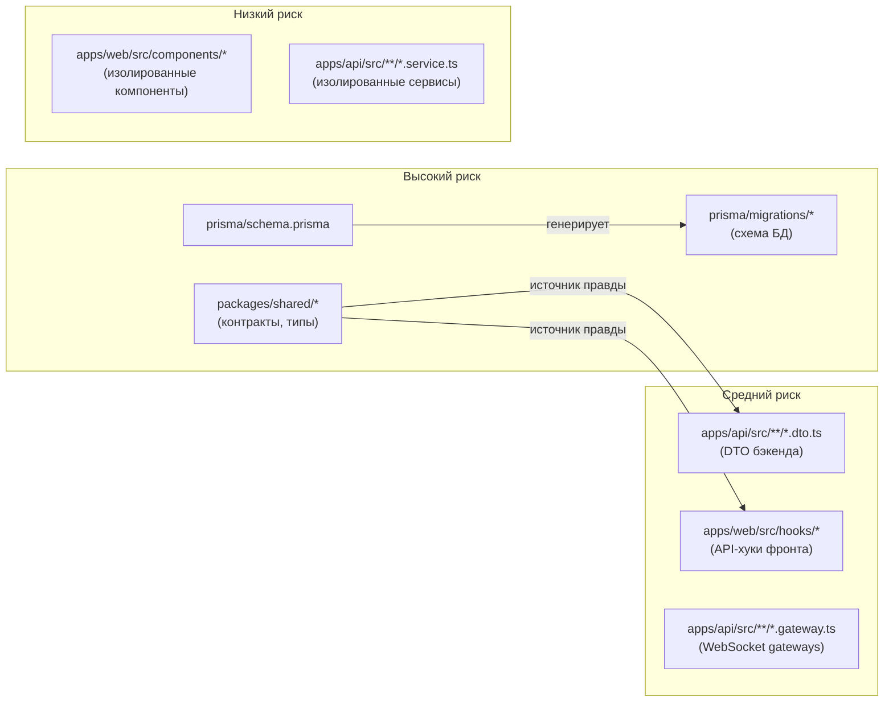
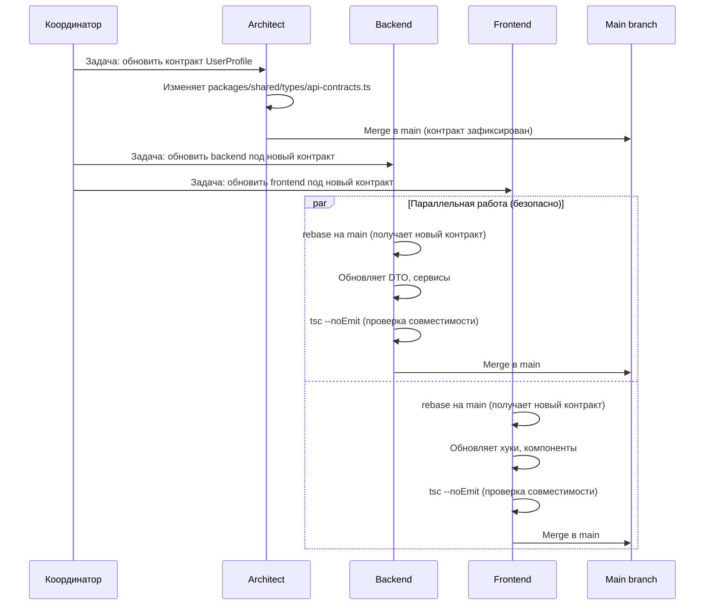

# Предотвращение логических конфликтов при параллельной работе агентов

## Контекст

Git worktrees решают файловые конфликты — агенты физически не могут перезаписать файлы друг друга. Однако два агента могут параллельно изменить API-контракт, схему БД или бизнес-логику несовместимым образом. Такие конфликты не обнаруживаются при git merge, потому что затрагивают разные строки/файлы, но нарушают логическую целостность.

## Примеры логических конфликтов

| Сценарий | Агент A | Агент B | Результат |
|----------|---------|---------|-----------|
| API-контракт | Добавляет поле `rating` (number) в `UserProfileResponse` | Добавляет поле `rating` (string) в другом файле, ожидая строку | Merge проходит, runtime crash |
| Схема БД | Добавляет колонку `status` в таблицу `games` | Добавляет миграцию, которая зависит от отсутствия этой колонки | Merge проходит, миграция падает |
| WebSocket-события | Меняет payload `game:move` (добавляет обязательное поле) | Использует `game:move` со старым payload | Merge проходит, клиент ломается |
| Бизнес-логика | Меняет формулу рейтинга в backend | Frontend отображает рейтинг по старой формуле | Данные расходятся |

## Зоны повышенного риска



### Классификация зон

**Высокий риск** — `packages/shared/`, `prisma/schema.prisma`, `prisma/migrations/`:
- Изменения здесь затрагивают всех потребителей (backend + frontend)
- Параллельные несогласованные изменения гарантированно ведут к поломке
- Правило: только один агент в один момент времени

**Средний риск** — DTO, API-хуки, WebSocket-gateways:
- Должны соответствовать shared-контрактам
- Конфликт возникает при рассинхронизации с `packages/shared/`
- Правило: изменяются только после обновления shared-контракта в main

**Низкий риск** — изолированные компоненты и сервисы:
- Работают через стабильные интерфейсы
- Параллельная работа безопасна

## Архитектурные решения

### 1. Contract-first: shared-пакет как единственный источник правды

`packages/shared/src/types/api-contracts.ts` уже существует и определяет все REST/WebSocket-контракты. Это правильная основа. Усиление:

**Правило:** Любое изменение API начинается с изменения `packages/shared/`. Backend и frontend адаптируются к новому контракту, а не наоборот.

**Последовательность:**
```
1. Агент меняет packages/shared/ → merge в main
2. Backend-агент обновляет DTO/сервисы под новый контракт → merge в main
3. Frontend-агент обновляет хуки/компоненты под новый контракт → merge в main
```

Параллельный запуск шагов 2 и 3 допустим — оба читают один и тот же зафиксированный контракт из main.

### 2. Автоматическая валидация совместимости при merge

#### 2.1. TypeScript strict mode как валидатор

Проект уже использует TypeScript. Shared-пакет экспортирует типы, которые импортируются в backend и frontend. Если контракт изменился несовместимо, `tsc --noEmit` в CI/pre-merge покажет ошибку компиляции.

**Что это ловит:**
- Переименование/удаление полей в контрактах
- Изменение типов полей (number → string)
- Добавление обязательных полей без обновления потребителей

**Что это НЕ ловит:**
- Семантические изменения (поле `rating` теперь в другой шкале)
- Изменения в runtime-поведении (формула расчёта)

#### 2.2. Prisma schema validation

`npx prisma validate` проверяет корректность schema.prisma. `npx prisma migrate diff` может обнаружить конфликтующие миграции.

#### 2.3. Рекомендуемый pre-merge checklist (git hook или CI)

```bash
#!/bin/bash
# pre-merge-check.sh — запускать перед merge в main
set -e

# 1. TypeScript компиляция всех пакетов
npx turbo run typecheck

# 2. Prisma schema валидация
cd apps/api && npx prisma validate

# 3. Тесты shared-пакета
npx turbo run test --filter=shared

# 4. Тесты API-контрактов (если есть)
npx turbo run test --filter=api -- --testPathPattern=contract
```

### 3. Правила работы с зонами повышенного риска

#### Правило A: Атомарность shared-изменений

Изменения в `packages/shared/` вносит один агент за раз. Координатор не назначает задачи, требующие параллельного изменения shared-пакета разными агентами.

#### Правило B: Миграции создаются последовательно

Prisma-миграции создаются строго последовательно. Два агента не могут одновременно создавать миграции — это гарантированный конфликт. Координатор отслеживает это через Jira-статусы задач с меткой `migration`.

#### Правило C: Rebase перед merge (уже в ADR-006)

Агент обязан сделать rebase на актуальный main и запустить `tsc --noEmit` перед merge. Это обнаруживает несовместимость с изменениями, попавшими в main после начала работы.

#### Правило D: Версионирование контрактов при ломающих изменениях

При ломающем изменении API (удаление поля, изменение типа) — поддерживать оба варианта на переходный период:

```typescript
// packages/shared/src/types/api-contracts.ts

// Deprecated: будет удалено после обновления всех потребителей
export type UserProfileResponseV1 = {
  rating: number;
};

// Текущая версия
export type UserProfileResponse = {
  ratingBullet: number;
  ratingBlitz: number;
  ratingRapid: number;
  ratingClassical: number;
};
```

Это позволяет backend и frontend мигрировать независимо.

### 4. Матрица ответственности (ownership)

| Зона | Владелец | Кто может менять |
|------|----------|------------------|
| `packages/shared/src/types/` | architect | architect, backend (с ревью) |
| `packages/shared/src/utils/` | backend | backend |
| `prisma/schema.prisma` | backend | backend |
| `prisma/migrations/` | backend | backend |
| `apps/api/src/` | backend | backend |
| `apps/web/src/` | frontend | frontend |
| `apps/e2e/` | qa | qa |
| `docs/` | architect | architect, любой (свои документы) |
| `infra/`, `docker-compose.yml` | devops | devops |

**Shared-зоны** (`packages/shared/src/types/`) — зона совместного доступа. Изменения здесь требуют:
1. Задача в Jira с явным указанием какой контракт меняется
2. Один агент вносит изменение → merge в main
3. Зависимые агенты подтягивают изменения

## Диаграмма процесса безопасного изменения контракта



## Что остаётся нерешённым

1. **Семантические конфликты** — TypeScript не ловит изменения в бизнес-логике (например, другая формула рейтинга). Это покрывается только интеграционными/e2e-тестами.
2. **Зависшие задачи** — если агент упал, задача остаётся "В работе" и блокирует shared-зону. Координатор должен отслеживать это вручную.
3. **Человеческий фактор** — все правила enforcement реализованы на уровне промптов и процессов, а не технических блокировок. При текущем масштабе (один разработчик) это приемлемый компромисс.
