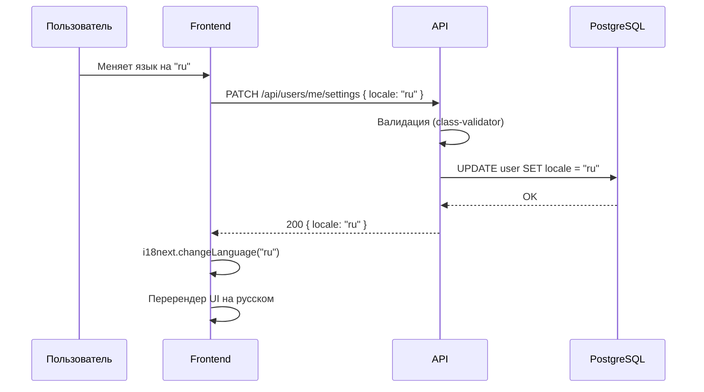
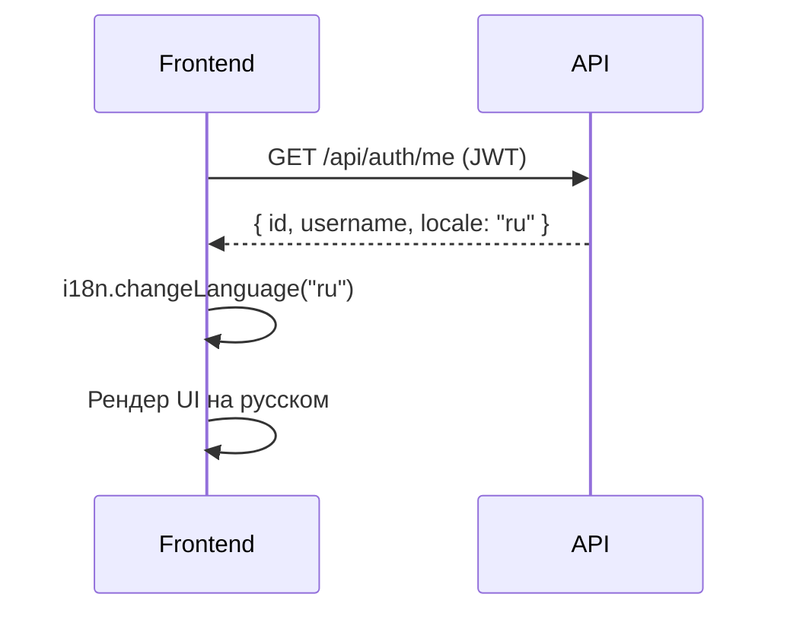

# Архитектура: страница настроек и система локализации

## 1. Страница настроек пользователя

### Маршрут

```
/settings — защищённый маршрут (ProtectedRoute)
```

### Секции настроек

| Секция | Поля | Описание |
|--------|------|----------|
| **Profile** | username (readonly), email | Основная информация |
| **Language** | locale (select: en, ru) | Выбор языка интерфейса |
| **Password** | currentPassword, newPassword, confirmPassword | Смена пароля |

### Компонентная структура (Frontend)

```
src/
├── pages/
│   └── SettingsPage.tsx          # Страница настроек
├── components/
│   └── settings/
│       ├── ProfileSection.tsx    # Секция профиля
│       ├── LanguageSection.tsx   # Секция языка
│       └── PasswordSection.tsx   # Секция смены пароля
```

### API эндпоинты (Backend)

```
PATCH  /api/users/me/settings   — обновление настроек (locale)
PATCH  /api/users/me/password   — смена пароля
```

### Изменения в модели User (Prisma)

```prisma
model User {
  // ... существующие поля
  locale  String @default("en")  // "en" | "ru"
}
```

### Диаграмма потока сохранения настроек



## 2. Система локализации (i18n)

### Библиотека: react-i18next

Обоснование выбора — см. ADR-005.

### Структура файлов переводов

```
src/
├── i18n/
│   ├── index.ts              # Инициализация i18next
│   └── locales/
│       ├── en/
│       │   └── translation.json
│       └── ru/
│           └── translation.json
```

### Структура JSON переводов

```json
{
  "nav": {
    "lobby": "Lobby",
    "settings": "Settings",
    "logout": "Log out"
  },
  "auth": {
    "login": "Log in",
    "register": "Register",
    "username": "Username",
    "email": "Email",
    "password": "Password"
  },
  "lobby": {
    "title": "Find a game",
    "play": "Play",
    "timeControl": "Time control"
  },
  "game": {
    "resign": "Resign",
    "offerDraw": "Offer draw",
    "whiteWins": "White wins",
    "blackWins": "Black wins",
    "draw": "Draw",
    "chat": "Chat"
  },
  "settings": {
    "title": "Settings",
    "profile": "Profile",
    "language": "Language",
    "password": "Password",
    "save": "Save",
    "currentPassword": "Current password",
    "newPassword": "New password",
    "confirmPassword": "Confirm password"
  }
}
```

### Инициализация i18next

```typescript
// src/i18n/index.ts
import i18n from 'i18next';
import { initReactI18next } from 'react-i18next';
import en from './locales/en/translation.json';
import ru from './locales/ru/translation.json';

i18n.use(initReactI18next).init({
  resources: {
    en: { translation: en },
    ru: { translation: ru },
  },
  lng: 'en',           // язык по умолчанию
  fallbackLng: 'en',
  interpolation: {
    escapeValue: false, // React уже экранирует
  },
});

export default i18n;
```

### Интеграция с AuthContext

При загрузке приложения (`GET /api/auth/me`) сервер возвращает `locale` пользователя.
Frontend вызывает `i18n.changeLanguage(user.locale)` для установки языка.



### Для неавторизованных пользователей

Используется `navigator.language` браузера с fallback на `"en"`.

## 3. Изменения в shared пакете

Обновить тип `User` в `packages/shared`:

```typescript
type User = {
  id: string;
  username: string;
  rating: number;
  createdAt: string;
  locale: string;   // добавить
};
```

## 4. Навигация

Добавить ссылку на `/settings` в `MainLayout.tsx` (иконка шестерёнки или текстовая ссылка).
