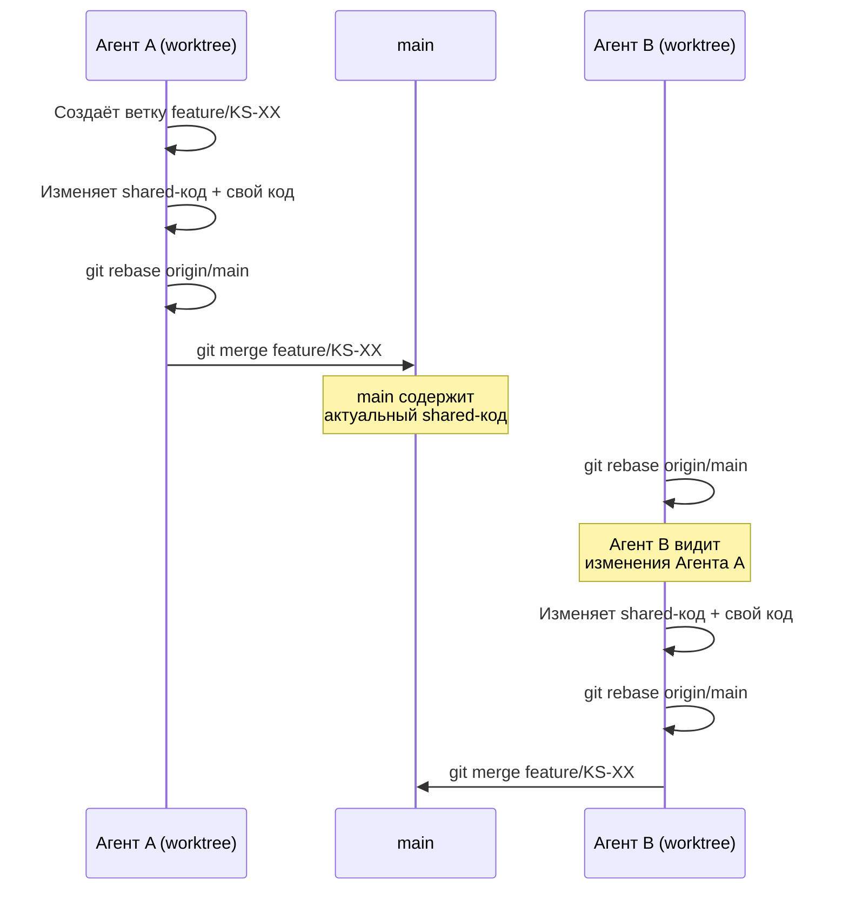

# Процедура изменения shared-кода

## Область действия

Данная процедура распространяется на все файлы, которые используются совместно backend- и frontend-агентами:

| Зона | Путь | Что содержит |
|------|------|-------------|
| Shared-пакет | `packages/shared/` | TypeScript-типы, API-контракты, константы, утилиты |
| Docker-конфиги | `docker-compose.yml` | Shared-инфраструктура |
| Корневые конфиги | `tsconfig.base.json`, `turbo.json`, `package.json` | Конфигурация монорепо |
| CI/CD | `.github/` | Пайплайны |
| Документация архитектуры | `docs/adr/`, `docs/architecture/` | ADR, архитектурные документы |

## Правило: один агент — одно изменение shared-зоны

Одновременные изменения shared-кода разными агентами **ЗАПРЕЩЕНЫ**. Shared-код модифицируется атомарно — один агент вносит изменение, мержит в main, после чего другой агент может вносить своё изменение.

### Почему

При параллельных изменениях shared-кода в разных worktrees:
- Оба агента видят старую версию файла
- Каждый вносит свои изменения независимо
- При merge один набор изменений затирает другой (или возникает конфликт, который сложно резолвить автоматически)

## Процедура изменения

### 1. Определить необходимость изменения

Агент (backend или frontend) обнаруживает, что ему нужно изменить shared-код. Примеры:
- Добавить новый тип в API-контракт
- Изменить существующий DTO
- Добавить WebSocket-событие
- Изменить shared-утилиту

### 2. Внести изменение и смержить

Агент вносит изменение в shared-код **в рамках своей текущей задачи**. Shared-изменение должно быть частью того же коммита или отдельным коммитом в той же ветке.

### 3. Rebase перед merge (обязательно)

Перед merge ветки в main агент **обязан** выполнить rebase на актуальный main:

```bash
git fetch origin main
git rebase origin/main
# Резолвить конфликты если есть
git checkout main
git merge feature/KS-XX
```

Это гарантирует, что:
- Конфликты обнаруживаются до попадания в main
- Агент видит все изменения, внесённые другими агентами после создания его ветки
- Main остаётся в консистентном состоянии

### 4. Другие агенты подтягивают изменения

После merge в main другие агенты, работающие в своих worktrees, должны подтянуть актуальный main перед своим merge:

```bash
git fetch origin main
git rebase origin/main
```

## Кто может менять shared-зоны

| Зона | Кто может менять | Условие |
|------|-----------------|---------|
| `packages/shared/src/types/` | backend, frontend | В рамках своей задачи, когда нужен новый тип/контракт |
| `packages/shared/src/constants.ts` | backend, frontend | В рамках своей задачи |
| `packages/shared/src/utils/` | backend, frontend | В рамках своей задачи |
| `docker-compose.yml` | devops | Только devops-агент |
| `tsconfig.base.json`, `turbo.json` | architect, devops | Архитектурные изменения |
| `.github/` | devops | Только devops-агент |
| `docs/adr/`, `docs/architecture/` | architect | Только architect-агент |
| `CONTRIBUTING.md` | architect | Только architect-агент |
| `package.json` (корневой) | devops, architect | Зависимости и конфигурация |

## Правила для API-контрактов (`packages/shared/src/types/`)

1. **Добавление нового типа** — допускается любым агентом (backend/frontend) без согласования, если тип не конфликтует с существующими
2. **Изменение существующего типа** — агент обязан убедиться, что изменение обратно совместимо (добавление optional-полей — допустимо; удаление или переименование полей — нет)
3. **Breaking changes** — требуют координации: агент, инициирующий breaking change, обязан обновить все места использования в **обоих** приложениях (api и web) в рамках одной задачи

## Диаграмма процедуры



## Что делать при конфликте в shared-коде

1. Конфликт обнаруживается на этапе rebase
2. Агент анализирует конфликт:
   - Если конфликт в типах/контрактах — нужно объединить оба набора изменений
   - Если конфликт логический (несовместимые изменения) — агент останавливается и сообщает координатору
3. После резолва — прогнать тесты shared-пакета: `npx turbo test --filter=shared`
