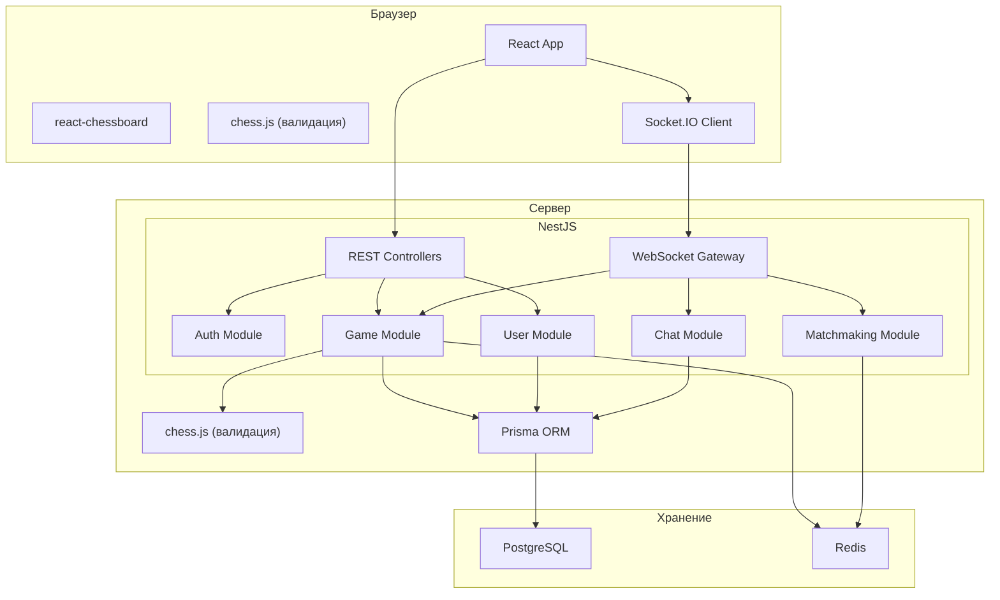
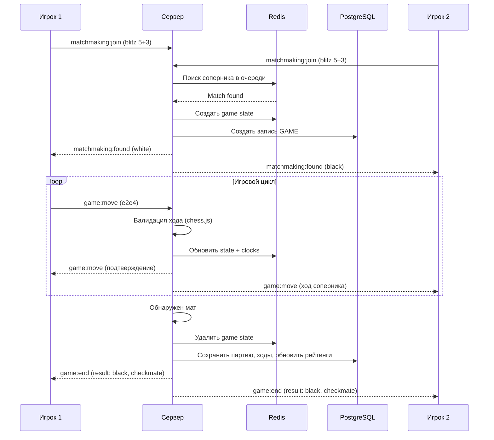

# Архитектура Kingside: обзор системы

## Диаграмма компонентов

## Поток игровой партии

## Модули NestJS

| Модуль | Ответственность |
|--------|----------------|
| **AuthModule** | Регистрация, логин, JWT, guards |
| **UserModule** | Профили, рейтинги |
| **GameModule** | Логика партии, валидация ходов, таймеры, персистенция |
| **MatchmakingModule** | Очередь поиска, подбор по рейтингу |
| **ChatModule** | Сообщения внутри партии |
| **AnalysisModule** | Сохранённые анализы партий: CRUD, шаринг по ссылке (статический snapshot) |
| **LiveAnalysisModule** | Трансляция анализа партии в реальном времени: автор двигает фигуры и аннотирует разбор, зрители по публичной ссылке видят актуальное состояние окна анализа целиком (доска, дерево вариантов, NAGs, комментарии, стрелки/выделения, headers). Каждая трансляция жёстко привязана к конкретному `Analysis.id`. См. ADR-110 + ADR-111 + ADR-112. |

## WebSocket namespaces

Socket.IO разнесён по namespace'ам в нескольких приложениях. Имена событий и payload'ы — в `packages/shared`.

| Namespace | Приложение | Хост | Auth | Назначение |
|-----------|------------|------|------|------------|
| `/game` | `apps/game-service` | `game.kingside.site` | JWT в handshake | Ходы партии, таймеры, end-of-game (см. поток выше) |
| `/matchmaking` | `apps/game-service` | `game.kingside.site` | JWT в handshake | Очередь подбора, события `found` |
| `/arena` | `apps/game-service` / `apps/api` | соответствующий хост | JWT | События арен/турниров |
| `/messages` | `apps/api` | `api.kingside.site` | JWT обязательный (без токена — disconnect) | Личные сообщения, статусы друзей, challenge |
| default (`/`) | `apps/broadcast-service` | `broadcasts.kingside.site` | без auth | Lichess broadcasts: subscribe на `roundId`, дельты ходов из Redis pub/sub. См. ADR-021 |
| `/live-analysis` | `apps/api` | `api.kingside.site` | JWT опциональный (есть → автор, нет → анонимный зритель) | Трансляция всего окна анализа: автор + просмотр зрителями по slug, привязка к `Analysis.id`. См. ADR-110 + ADR-111 + ADR-112 |

### Модуль `/live-analysis` — краткая карточка

- **Назначение:** автор открывает разбор партии (`AnalysisPage`) — двигает фигуры, расставляет варианты, NAGs, комментарии, стрелки/выделения; зрители по публичной ссылке `kingside.site/live/<slug>` видят актуальное состояние окна анализа в реальном времени. Страница зрителя (`LiveAnalysisViewerPage`) — тонкая обёртка над `AnalysisPage` с режимом `liveBroadcast={slug, mode:'viewer'}`: переиспользует ту же боковую панель, ReviewMoveList, доску, opening tree, локальный Stockfish. Зритель может локально экспериментировать (своя ветка), не влияя ни на автора, ни на других; при поступившем обновлении показывается значок «Получено обновление» с кнопкой применения.
- **Где живёт:** модуль `apps/api/src/live-analysis/` (controller + service + gateway). Не в `apps/broadcast-service` (там Lichess-стримы с pull-моделью) и не отдельный сервис (один разработчик, текущий масштаб держится одним инстансом `apps/api`).
- **Транспорт:** namespace `/live-analysis` на `api.kingside.site`. Гибридный протокол:
  - `MOVE` (UCI-дельта + FEN) — мгновенно на каждый ход автора, для плавной анимации у зрителя;
  - `STATE_PATCH { slug, pgn, headers?, currentPly?, orientation? }` (ADR-111) — аннотированный PGN целиком с дебаунсом 500 мс у автора, источник истины для дерева вариантов, NAGs, комментариев, стрелок (`[%cal]`), выделений клеток (`[%csl]`), цветов вариаций (`[%cvc]`), PGN headers. На сервере конвертируется в `SYNC` и публикуется через тот же pub/sub-канал;
  - `SUBSCRIBE` (с опциональным `mode: 'board' | 'full'`, по умолчанию `full`), `UNSUBSCRIBE`, `SYNC` (с полями `currentPgn`, `headers`, `title`, `ownerUsername`), `RESET`, `CLOSE`, `VIEWERS`, `CLOSED`, `ERROR` (включая код `pgn-too-large`).
  - Размер PGN ограничен 256 KB, в gateway включены `perMessageDeflate` и `maxHttpBufferSize: 512000`. Rate-limit `STATE_PATCH` у автора — 5/сек с burst 10 (поверх существующего лимита ходов).
- **Модель данных:**
  - PostgreSQL — таблица `live_analyses` (метаданные: `id`, `slug` UNIQUE, `ownerId`, `title`, `startingFen`, `status` active/closed, `createdAt`, `closedAt`, `lastActivityAt`, `viewerPeak`). **Расширение по ADR-112**: колонка `analysisId` (FK на `analyses.id`, `ON DELETE SET NULL`) + частичный уникальный индекс `(owner_id, analysis_id) WHERE status='active' AND analysis_id IS NOT NULL` (создаётся raw SQL в миграции — Prisma такое в схеме не выражает). Гарантирует «одна активная трансляция на (автор, анализ)»; закрытые и осиротевшие (`analysis_id IS NULL`) этому индексу не подчиняются. Удаление анализа сохраняет историю трансляции, ссылка обнуляется. Аннотированный PGN остаётся эфемерным (только Redis).
  - Redis — текущее состояние и история ходов:
    - hash `live_analysis:<id>:state` — `currentFen`, `currentPly`, `startingFen`, `orientation` + **расширение по ADR-111**: `currentPgn` (аннотированный PGN автора, hard cap 256 KB) и `headersJson` (PGN headers отдельной мапой для быстрого чтения `GameMetaBar` без парсинга). TTL 24ч, продлевается на каждое изменение;
    - list `live_analysis:<id>:moves` — UCI-история; при `STATE_PATCH` сервер пересинхронизирует список с main-line загруженного PGN, чтобы поздно подключившийся зритель не получил рассинхрон;
    - integer `live_analysis:<id>:viewers` — счётчик активных подключений;
    - pub/sub каналы `live-analysis:move|sync|closed`. Отдельного канала под `state-patch` нет — он сводится к `sync`.
- **REST-эндпоинты** (`apps/api/src/live-analysis/live-analysis.controller.ts`):
  - `POST /live-analyses` (JwtAuthGuard) — `analysisId` обязателен. Идемпотентен: повторный POST с тем же `analysisId` или гонка двух вкладок автора (Prisma P2002 на partial UNIQUE) возвращают существующую активную трансляцию. Сервер дополнительно проверяет, что `Analysis` принадлежит автору (404/403).
  - `GET /live-analyses/by-analysis/:analysisId` (JwtAuthGuard, owner-only) — **новый по ADR-112**. Единственный источник восстановления состояния на странице автора: возвращает текущую активную трансляцию для конкретного анализа или 404. Используется на каждом mount `AnalysisPage` автора с реальным `analysisId`.
  - `GET /live-analyses/me` (JwtAuthGuard) — список своих, элементы расширены полем `analysisId`.
  - `GET /live-analyses/:slug` (анонимный) — snapshot для зрителя, в ответе тоже есть `analysisId`.
  - `DELETE /live-analyses/:slug` (JwtAuthGuard, owner-only) — без изменений.
- **Авторизация:** создать/удалить трансляцию — только аутентифицированный (JwtAuthGuard). Эмитить `MOVE` / `STATE_PATCH` / `RESET` / `CLOSE` — только владелец (проверка `ownerId === user.id` в gateway). Подписка зрителем — без auth.
- **Жизненный цикл:** создаётся через `POST /live-analyses` с обязательным `analysisId`, slug = `nanoid(10)`. Закрывается явно владельцем (`DELETE` или WS `close`) или по таймауту 30 мин неактивности (cron-job каждые 5 мин). Любой `MOVE` / `STATE_PATCH` обновляет `lastActivityAt` (throttle 10с). При удалении самого `Analysis` запись трансляции переживает (`analysis_id` обнуляется), но через `GET /by-analysis/:id` больше не находится.
- **Состояние на frontend:** хранение slug в `localStorage` **полностью удалено** (ADR-112). На каждый mount `AnalysisPage` автора хук `useAnalysisLiveBroadcast` восстанавливает состояние через `GET /by-analysis/:analysisId`. Единственный источник истины — backend; смена страницы анализа = смена контекста хука, никаких ложных подхватов чужих slug'ов (ошибка KS-3754 закрыта корнем).
  - Для разбора партии (`kind='review'`) и задачи (`kind='puzzle'`) кнопка «Транслировать» неактивна с подсказкой «Сначала сохраните в мастерскую».
  - Для разбора без сохранения (`kind='analysis'` без `analysisId`) кнопка запускает сценарий «Сохранить и транслировать»: сначала создаётся `Analysis` через autosave, затем `POST /live-analyses` с полученным id.
- **Что НЕ передаётся через WS:** opening tree (`ArchiveTreePanel` запрашивает `/archive/tree?fen=...` локально), Stockfish-линии (локальный wasm у каждого зрителя), AI position comment (локальный запрос к LLM-endpoint). Все три — производные от FEN/позиции, синхронизировать через канал автора смысла нет.
- **Подробности:** [ADR-110](../adr/110-live-analysis-broadcast.md), [ADR-111](../adr/111-live-analysis-full-broadcast.md), [ADR-112](../adr/112-live-analysis-per-analysis-binding.md).

## Ограничения и компромиссы

1. **Один сервер** — горизонтальное масштабирование WebSocket потребует sticky sessions или Redis adapter для Socket.IO. Пока не требуется.
2. **Нет микросервисов** — модульный монолит внутри NestJS. Разбиение на микросервисы оправдано только при росте нагрузки.
3. **Нет очередей сообщений** — при текущем масштабе прямое взаимодействие через Redis достаточно.
