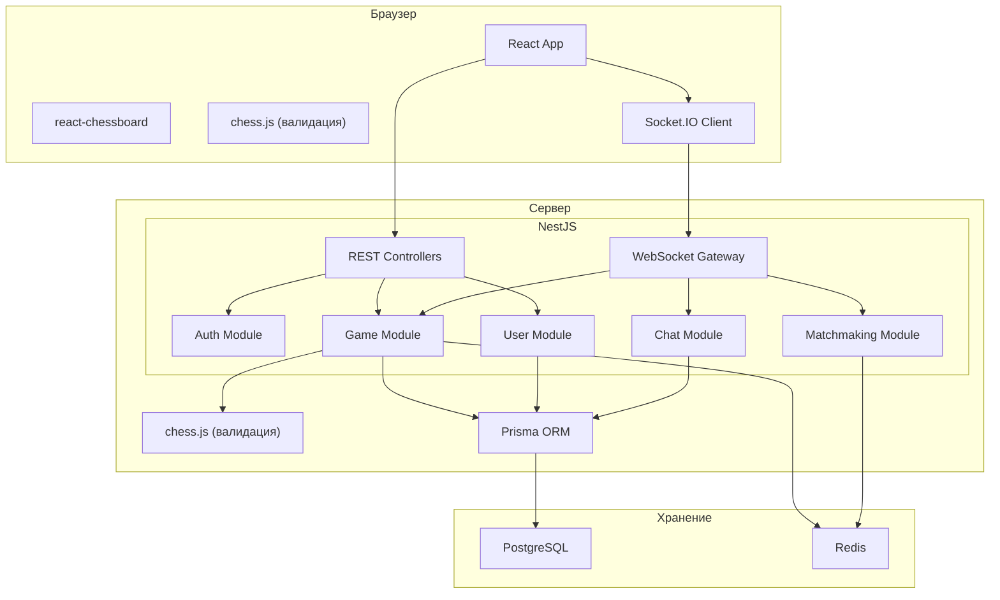
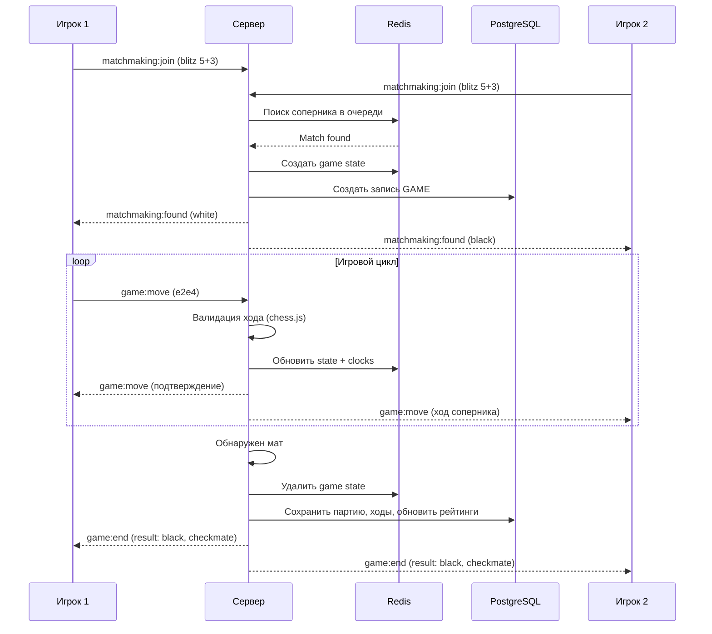

# Архитектура Kingside: обзор системы

## Диаграмма компонентов

## Поток игровой партии

## Модули NestJS

| Модуль | Ответственность |
|--------|----------------|
| **AuthModule** | Регистрация, логин, JWT, guards |
| **UserModule** | Профили, рейтинги |
| **GameModule** | Логика партии, валидация ходов, таймеры, персистенция |
| **MatchmakingModule** | Очередь поиска, подбор по рейтингу |
| **ChatModule** | Сообщения внутри партии |
| **AnalysisModule** | Сохранённые анализы партий: CRUD, шаринг по ссылке (статический snapshot) |
| **LiveAnalysisModule** | Трансляция анализа партии в реальном времени: автор двигает фигуры, зрители по публичной ссылке видят ходы. См. ADR-110. |

## WebSocket namespaces

Socket.IO разнесён по namespace'ам в нескольких приложениях. Имена событий и payload'ы — в `packages/shared`.

| Namespace | Приложение | Хост | Auth | Назначение |
|-----------|------------|------|------|------------|
| `/game` | `apps/game-service` | `game.kingside.site` | JWT в handshake | Ходы партии, таймеры, end-of-game (см. поток выше) |
| `/matchmaking` | `apps/game-service` | `game.kingside.site` | JWT в handshake | Очередь подбора, события `found` |
| `/arena` | `apps/game-service` / `apps/api` | соответствующий хост | JWT | События арен/турниров |
| `/messages` | `apps/api` | `api.kingside.site` | JWT обязательный (без токена — disconnect) | Личные сообщения, статусы друзей, challenge |
| default (`/`) | `apps/broadcast-service` | `broadcasts.kingside.site` | без auth | Lichess broadcasts: subscribe на `roundId`, дельты ходов из Redis pub/sub. См. ADR-021 |
| `/live-analysis` | `apps/api` | `api.kingside.site` | JWT опциональный (есть → автор, нет → анонимный зритель) | Трансляция анализа автором + просмотр зрителями по slug. См. ADR-110 |

### Модуль `/live-analysis` — краткая карточка

- **Назначение:** автор открывает разбор партии (`AnalysisPage`), двигает фигуры; зрители по публичной ссылке `kingside.site/live/<slug>` видят ходы в реальном времени. Зритель может локально экспериментировать (своя ветка), не влияя ни на автора, ни на других.
- **Где живёт:** модуль `apps/api/src/live-analysis/` (controller + service + gateway). Не в `apps/broadcast-service` (там Lichess-стримы с pull-моделью) и не отдельный сервис (один разработчик, текущий масштаб держится одним инстансом `apps/api`).
- **Транспорт:** namespace `/live-analysis` на `api.kingside.site`. Дельта по UCI + страховочный FEN. События: `subscribe`/`unsubscribe`/`move`/`reset`/`close`/`sync`/`viewers`/`closed`/`error`.
- **Модель данных:**
  - PostgreSQL — таблица `live_analyses` (метаданные: `id`, `slug` UNIQUE, `ownerId`, `title`, `startingFen`, `status` active/closed, `createdAt`, `closedAt`, `lastActivityAt`, `viewerPeak`).
  - Redis — текущее состояние и история ходов:
    - hash `live_analysis:<id>:state` — `currentFen`, `currentPly`, `startingFen`, `orientation` (TTL 24ч);
    - list `live_analysis:<id>:moves` — UCI-история для догона поздно подключившихся зрителей;
    - integer `live_analysis:<id>:viewers` — счётчик активных подключений;
    - pub/sub каналы `live-analysis:move|sync|closed`.
- **Авторизация:** создать/удалить трансляцию — только аутентифицированный (JwtAuthGuard). Эмитить ходы — только владелец (проверка `ownerId === user.id` в gateway). Подписка зрителем — без auth.
- **Жизненный цикл:** создаётся через `POST /live-analyses`, slug = `nanoid(10)`. Закрывается явно владельцем (`DELETE` или WS `close`) или по таймауту 30 мин неактивности (cron-job каждые 5 мин).
- **Подробности:** [ADR-110](../adr/110-live-analysis-broadcast.md).

## Ограничения и компромиссы

1. **Один сервер** — горизонтальное масштабирование WebSocket потребует sticky sessions или Redis adapter для Socket.IO. Пока не требуется.
2. **Нет микросервисов** — модульный монолит внутри NestJS. Разбиение на микросервисы оправдано только при росте нагрузки.
3. **Нет очередей сообщений** — при текущем масштабе прямое взаимодействие через Redis достаточно.
