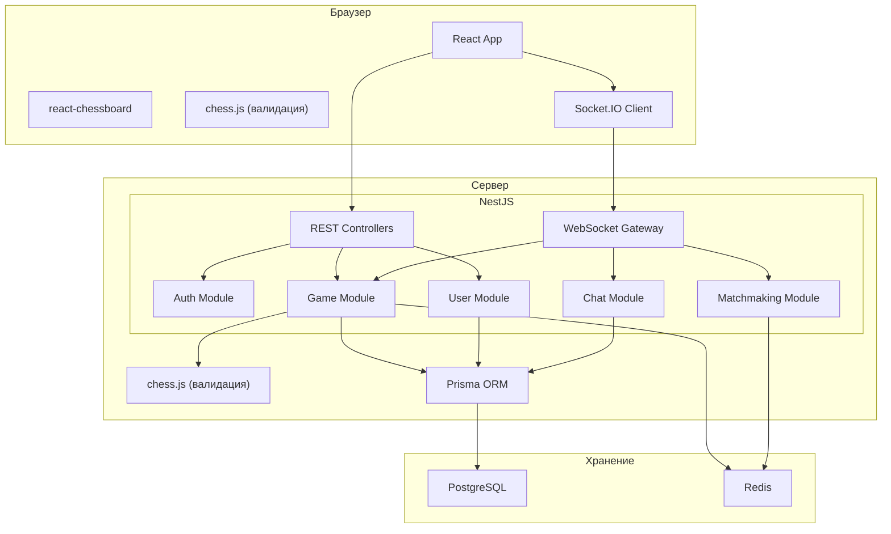
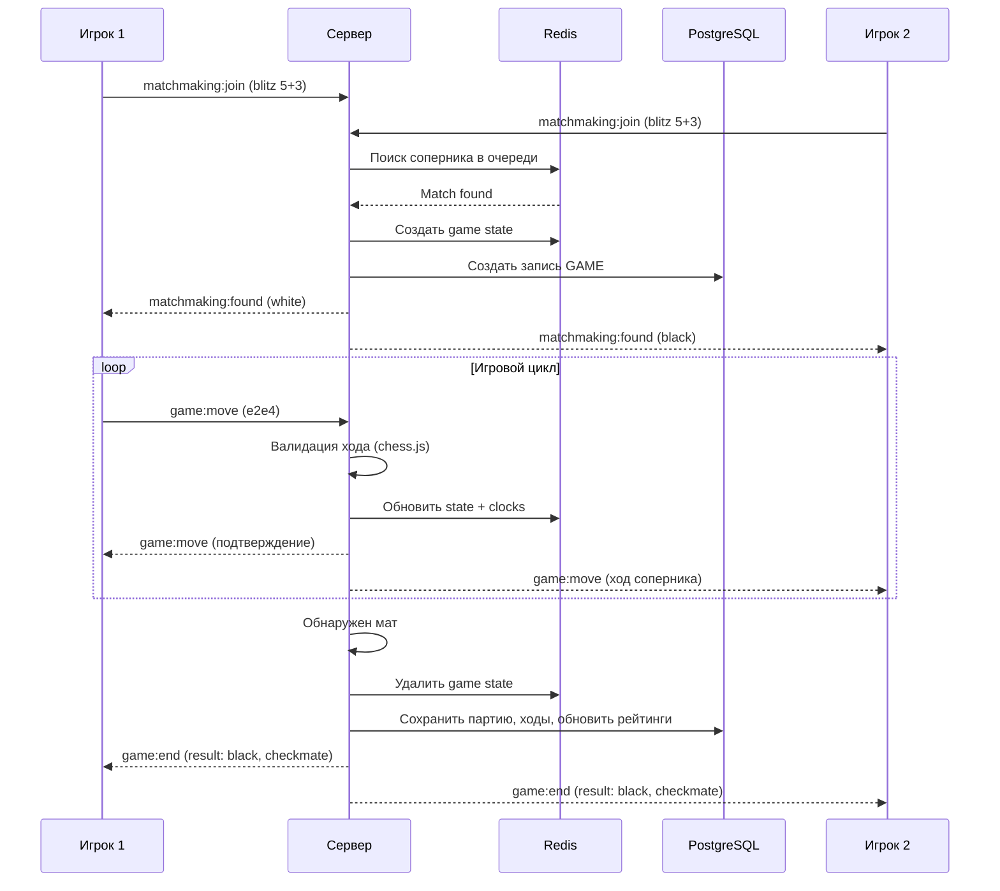

# Архитектура Kingside: обзор системы

## Диаграмма компонентов

## Поток игровой партии

## Модули NestJS

| Модуль | Ответственность |
|--------|----------------|
| **AuthModule** | Регистрация, логин, JWT, guards |
| **UserModule** | Профили, рейтинги |
| **GameModule** | Логика партии, валидация ходов, таймеры, персистенция |
| **MatchmakingModule** | Очередь поиска, подбор по рейтингу |
| **ChatModule** | Сообщения внутри партии |

## Ограничения и компромиссы

1. **Один сервер** — горизонтальное масштабирование WebSocket потребует sticky sessions или Redis adapter для Socket.IO. Пока не требуется.
2. **Нет микросервисов** — модульный монолит внутри NestJS. Разбиение на микросервисы оправдано только при росте нагрузки.
3. **Нет очередей сообщений** — при текущем масштабе прямое взаимодействие через Redis достаточно.
